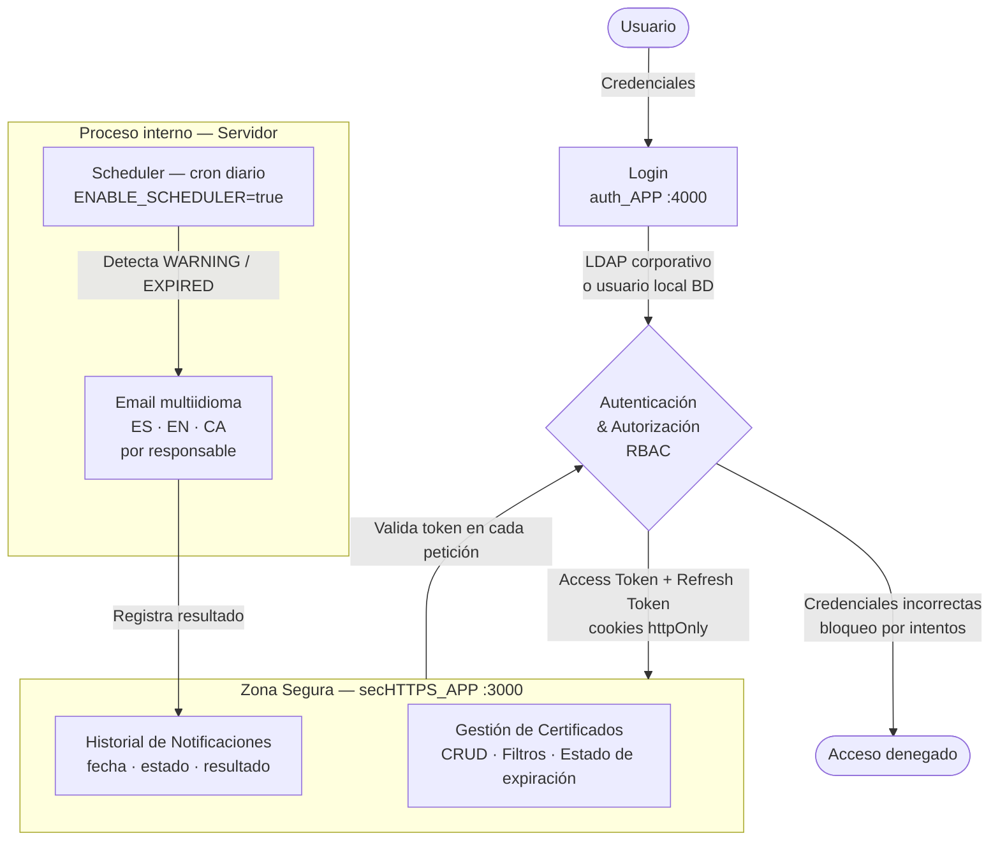

# Sistema de Gestión y Monitorización de Certificados SSL/TLS

## ¿Por qué existe este proyecto?

La expiración silenciosa de un certificado SSL/TLS puede interrumpir servicios completos sin previo aviso.
Este proyecto nace como solución a esa problemática: monitorizar de forma continua los certificados
instalados en los servidores del cliente y notificar anticipadamente a sus responsables cuando la
caducidad se acerca.

Dada la **naturaleza crítica** de la información que maneja —rutas de certificados, datos de servidores,
credenciales de directorio corporativo (LDAP/Active Directory) y configuración SMTP—, el sistema está
diseñado para instalarse **directamente en los servidores del cliente**. Los parámetros sensibles de
operación se establecen de forma local en el servidor; el repositorio incluye únicamente ficheros
`.env.example` como guía para una configuración correcta.

El vídeo **`secHTTPS_Funcionalidades.mp4`** incluido en el repositorio ofrece una demostración
completa del sistema en funcionamiento: recorre las pantallas principales con los distintos perfiles
de usuario (`admin`, `editor`, `viewer`, `auditor`), ilustrando cómo varía la interfaz y los
permisos disponibles según el rol. Sirve como referencia funcional sin necesidad de levantar
el entorno completo.

La presentación del proyecto está disponible en:
[**Slides — secHTTPS en Canva**](https://www.canva.com/design/DAHB89s09uU/nObqsEHBVbXngGgEVLAuDg/view?utm_content=DAHB89s09uU&utm_campaign=designshare&utm_medium=link2&utm_source=uniquelinks&utlId=h43eecb6c19)

---

## Funcionalidades

### Autenticación y control de acceso

- **Login híbrido**: autenticación contra directorio corporativo (LDAP/Active Directory) con fallback
  automático a usuarios locales en base de datos.
- **Bloqueo por intentos fallidos**: tras superar el máximo configurado de credenciales incorrectas,
  el acceso queda bloqueado temporalmente.
- **RBAC (Role-Based Access Control)**: perfiles `admin`, `editor`, `auditor` y `viewer` con permisos
  diferenciados sobre las funcionalidades.
- **JWT Access + Refresh Token**: tokens de corta duración (15 min) renovados automáticamente desde
  cookie segura, sin necesidad de nuevo login durante 7 días. (configurable)

### Gestión de certificados

- Alta, consulta, actualización y baja lógica de certificados SSL/TLS.
- Datos registrados: nombre y ruta del fichero, servidor de instalación, ruta de configuración, cliente
  propietario y contactos de los responsables.
- Cálculo automático del **estado de expiración**: `NORMAL`, `WARNING` (≤ 7 días para expirar) y `EXPIRED`.
- Filtrado por cliente, servidor, nombre de fichero, estado del certificado y estado de expiración.

### Notificaciones automáticas

- Proceso programado (cron) que se ejecuta diariamente en el servidor, detecta certificados en estado
  `WARNING` o `EXPIRED` y envía alertas por email.
- Cada contacto responsable recibe el email **en su idioma** (Español, English, Català).
- Frecuencia adaptada a la urgencia: cada 2 días en `WARNING`, diariamente en `EXPIRED`.

### Visualización

- Listado de certificados con estado de expiración calculado en tiempo real y filtros avanzados.
- Historial de notificaciones enviadas de cada certificado.

---

## Diagrama de arquitectura



> El scheduler (`CRON_EXPRESSION` configurable, por defecto `0 8 * * *`) se ejecuta en el backend de
> forma autónoma. Actúa directamente sobre la base de datos y procesa los envíos.

---

## Proyectos

El sistema está organizado como un repositorio único (*monorepo*) con dos aplicaciones independientes desplegadas en el mismo servidor:

| Proyecto | Descripción | README detallado |
|---|---|---|
| `auth_APP` | Servicio de autenticación, autorización y gestión de usuarios (JWT, LDAP, RBAC) | [auth_APP/README.md](auth_APP/README.md) |
| `secHTTPS_APP` | API y frontend para gestión de certificados, notificaciones y scheduler | [secHTTPS_APP/README.md](secHTTPS_APP/README.md) |

Cada proyecto incluye:

- `docs/` — documentación técnica detallada (diseño de API, testing, base de datos, seguridad, etc.)
- `src/infrastructure/database/migrations/` — migraciones de base de datos numeradas e incrementales
- `docs/openapi.yaml` — especificación OpenAPI 3.0 de la API del proyecto

Especificaciones OpenAPI:

- Autenticación y usuarios: [auth_APP/docs/openapi.yaml](auth_APP/docs/openapi.yaml)
- Certificados y notificaciones: [secHTTPS_APP/docs/openapi.yaml](secHTTPS_APP/docs/openapi.yaml)

---

## Configuración

Los ficheros de configuración sensibles **no se incluyen en el repositorio**. Consultar los ficheros
`.env.example` de cada proyecto como referencia para la configuración del entorno:

```
auth_APP/.env.example      → PostgreSQL, JWT secrets, LDAP/AD, contraseña admin inicial
secHTTPS_APP/.env.example  → PostgreSQL, SMTP, cron expression, JWT secrets, URL del cliente
```

Ver el README de cada proyecto para la descripción completa de cada variable de entorno y los
pasos de instalación y arranque.

[`docs/pasos_buenos.md`](docs/pasos_buenos.md) es una guía de referencia rápida para actualizar
el servidor con nuevos cambios — desde el `git pull` hasta la verificación de los servicios.
Especialmente útil durante el desarrollo iterativo.

---

## Demostración en vídeo

Dado que la aplicación maneja información crítica de infraestructura, es imperativo que el proyecto
se distribuya exclusivamente en las instalaciones del cliente para uso exclusivo de este, 
se incluye el vídeo **`secHTTPS_Funcionalidades.mp4`** como demostración completa del sistema 
en funcionamiento.

El vídeo recorre las pantallas principales de la aplicación con distintos tipos de usuario
(`admin`, `editor`, `viewer`), mostrando cómo varía la interfaz y los permisos
disponibles en función del rol. Sirve como referencia funcional sin necesidad de levantar
el entorno completo.

---

## Estrategías de mejora

- **Frontend de gestión de autenticación**: interfaz de usuario completa para `auth_APP` — gestión
  de usuarios, asignación de roles, consulta de sesiones activas y administración del directorio LDAP,
  de forma equivalente a la interfaz ya disponible en `secHTTPS_APP`.

- **Multi-empresa (multi-tenant)**: adaptar la plataforma para que múltiples empresas puedan operar
  de forma aislada sobre la misma instalación. Cada empresa gestionaría únicamente sus propios
  certificados, responsables y notificaciones, sin visibilidad sobre los datos del resto de clientes.
