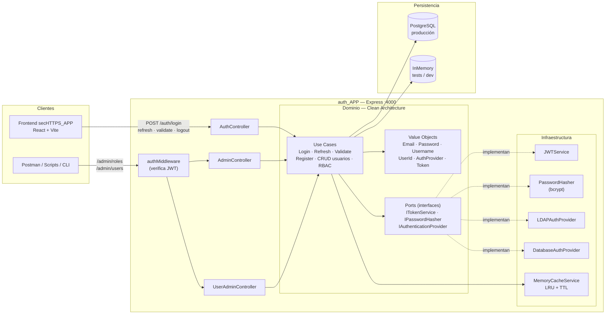
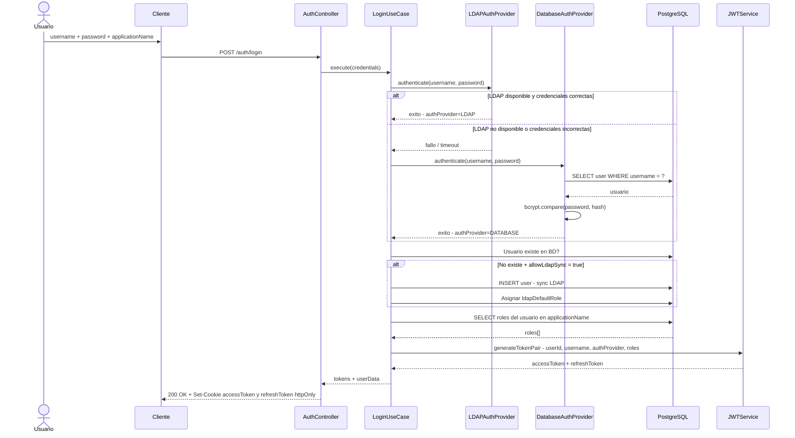
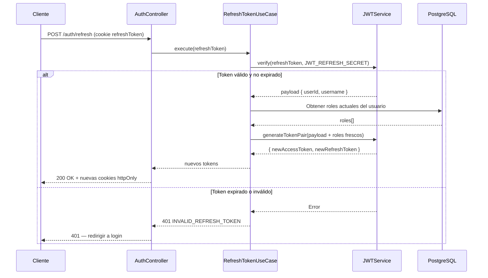
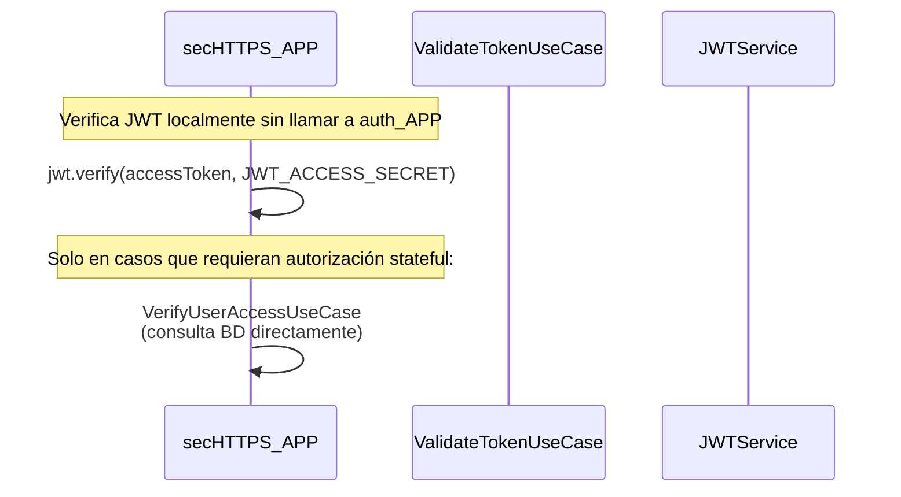
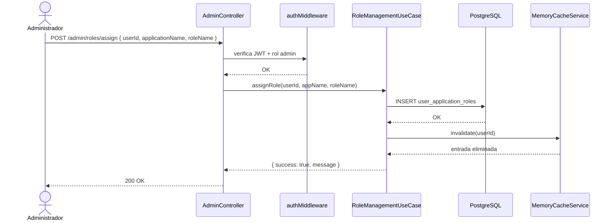
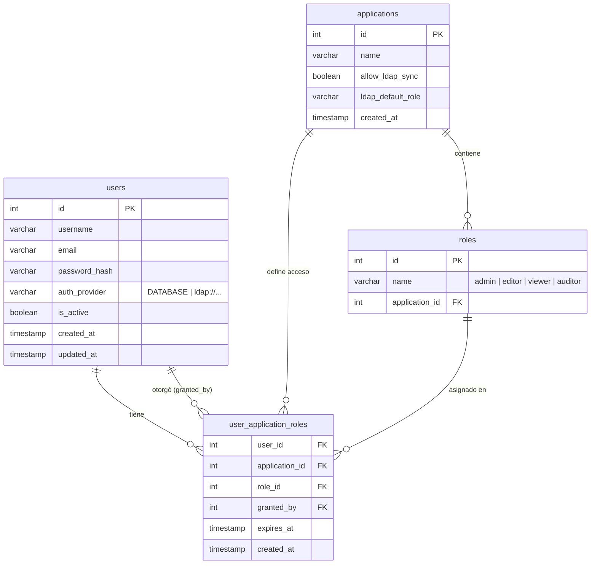

# auth_APP — Servicio de Autenticación y Autorización

Microservicio REST de autenticación multi-proveedor con JWT, RBAC por aplicación y soporte
opcional para LDAP / Active Directory.

Forma parte del ecosistema **secHTTPS** — sistema de gestión de certificados SSL/TLS instalados
en servidores de la organización.

> Documentación técnica detallada en [`docs/`](docs/) · Decisiones de arquitectura en [`adr/`](adr/)

---

## Índice

1. [Visión funcional](#1-visión-funcional)
2. [Arquitectura del sistema](#2-arquitectura-del-sistema)
3. [Estructura del proyecto](#3-estructura-del-proyecto)
4. [Diagramas de secuencia](#4-diagramas-de-secuencia)
5. [Sistema de migraciones](#5-sistema-de-migraciones)
6. [Modelo de datos (RBAC)](#6-modelo-de-datos-rbac)
7. [API](#7-api)
8. [Caché de roles](#8-caché-de-roles)
9. [Instalación](#9-instalación)
10. [Variables de entorno](#10-variables-de-entorno)
11. [Scripts disponibles](#11-scripts-disponibles)
12. [Tests](#12-tests)
13. [Decisiones de diseño](#13-decisiones-de-diseño)
14. [Documentación técnica](#14-documentación-técnica)

---

## 1. Visión funcional

`auth_APP` resuelve el problema de gestionar distintos tipos de usuario con acceso controlado a
múltiples aplicaciones desde un único punto de autenticación.

### Modos de operación

**Modo base de datos (siempre requerido)**

La BD PostgreSQL es el componente central, independientemente del método de autenticación:
- Almacena usuarios, aplicaciones y la asignación de roles (`user_application_roles`)
- Gestiona todo el RBAC: asignación, revocación y auditoría de roles vía API `/admin`
- Los usuarios LDAP se sincronizan automáticamente la primera vez que se autentican (si
  `allow_ldap_sync = true` en la aplicación, con el perfil especificado por defecto). 

**Modo LDAP / Active Directory (opcional, apilable)**

Se pueden configurar **uno o varios** servidores LDAP que actúan como providers adicionales:
- El sistema prueba cada provider en orden de prioridad hasta que uno tiene éxito
- Si todos los LDAP fallan, resuelve el provider de base de datos como fallback automático
- El JWT incluye `authProvider` para identificar qué proveedor autenticó al usuario

| Configuración | Comportamiento |
|---|---|
| `ENABLE_LDAP=false` | Solo BD local |
| 1 servidor LDAP + `ENABLE_LDAP=true` | LDAP primario, BD fallback |
| N servidores LDAP | Cascade: LDAP1 → LDAP2 → ... → BD fallback |

### Responsabilidad de cada capa del ecosistema

```
auth_APP  →  Autenticación + Autorización + Gestión de usuarios/roles
                      ↓
             Emite JWT en cookies httpOnly
                      ↓
secHTTPS_APP  →  Verifica JWT localmente (sin llamar a auth_APP)
                 Aplica RBAC en cada petición
```

> **Punto clave:** `secHTTPS_APP` nunca llama a `auth_APP` durante el proceso normal de una
> petición. El JWT se verifica localmente con el `JWT_ACCESS_SECRET` compartido — no hay
> acoplamiento en runtime entre los dos servicios.

---

## 2. Arquitectura del sistema

### 2.1. Vista general



### 2.2. Clean Architecture — Hexagonal

```
┌──────────────────────────────────────────────────────────────┐
│  TRANSPORT LAYER  (Express · Routes · Controllers)           │
│  — Serialización HTTP, cookies, cabeceras                    │
└──────────────────────┬───────────────────────────────────────┘
                       │ DTOs (primitivos)
┌──────────────────────▼───────────────────────────────────────┐
│  APPLICATION LAYER  (Use Cases)                              │
│  — Orquestación: autenticar, emitir tokens, gestionar roles  │
└──────────────────────┬───────────────────────────────────────┘
                       │ Entidades / Value Objects
┌──────────────────────▼───────────────────────────────────────┐
│  DOMAIN LAYER  (Value Objects · Interfaces · Errors)         │
│  — Reglas de negocio puras, sin IO, sin frameworks           │
└──────────────────────────────────────────────────────────────┘
        ↑ implementan los puertos (interfaces de dominio)
┌───────────────────────────────────────────────────────────────┐
│  INFRASTRUCTURE LAYER                                         │
│  PostgreSQL · InMemory · bcrypt · JWT · ldapjs · cache       │
└───────────────────────────────────────────────────────────────┘
```

**Regla de dependencias:** `domain/` no importa nada de `infrastructure/`. Toda dependencia
fluye hacia adentro. Esto permite usar `InMemoryRepository` en tests sin modificar ningún
use case.

### 2.3. Value Objects de dominio

| Value Object | Invariante |
|---|---|
| `Email` | Formato RFC válido, normalizado a minúsculas |
| `Password` | Mínimo 8 caracteres, al menos 1 mayúscula, 1 número |
| `Username` | Alfanumérico + guión/punto, 3-50 caracteres |
| `UserId` | Entero positivo |
| `AuthProvider` | URL LDAP válida o `DATABASE` |
| `Token` | String no vacío |

### 2.4. Stack tecnológico

| Capa | Tecnología |
|---|---|
| Runtime | Node.js 18+ · TypeScript strict · ES2021 |
| Framework HTTP | Express v5 |
| Autenticación | `jsonwebtoken` · `bcrypt` · `ldapjs` |
| Base de datos | PostgreSQL 16 (driver `pg`) |
| Caché | In-memory (LRU + TTL configurable) |
| Testing | Vitest 4 · Supertest |
| Contenedores | Docker · Docker Compose |

---

## 3. Estructura del proyecto

```
src/
├── app.ts                          # Factory: createApp() — composición de dependencias
├── server.ts                       # Punto de entrada: startServer()
│
├── domain/
│   ├── errors/
│   │   └── DomainError.ts          # Clase base de errores de negocio (→ HTTP mapping)
│   ├── repositories/               # Puertos (interfaces) de persistencia
│   │   ├── IUserRepository.ts
│   │   └── IApplicationRepository.ts
│   ├── services/                   # Puertos de servicios externos
│   │   ├── ITokenService.ts
│   │   ├── IPasswordHasher.ts
│   │   └── IAuthenticationProvider.ts
│   ├── usecases/
│   │   ├── LoginUseCase.ts         # Cascade de providers → JWT → cookies
│   │   ├── RefreshTokenUseCase.ts  # Rota refreshToken → nuevo par de tokens
│   │   ├── ValidateTokenUseCase.ts # Verifica firma + expiración (sin BD)
│   │   ├── RegisterUserUseCase.ts  # Alta de usuario + hash de contraseña
│   │   ├── CreateUserUseCase.ts    # Crear usuario (vía /admin)
│   │   ├── UpdateUserUseCase.ts
│   │   ├── DeleteUserUseCase.ts
│   │   ├── GetUsersUseCase.ts
│   │   ├── GetUserByIdUseCase.ts
│   │   ├── RoleManagementUseCases.ts  # assign · revoke · revoke-all · revoke-all-in-app
│   │   └── VerifyUserAccessUseCase.ts # Verifica rol en BD (stateful)
│   └── value-objects/
│       ├── Email.ts
│       ├── Password.ts
│       ├── Username.ts
│       ├── UserId.ts
│       ├── AuthProvider.ts
│       └── Token.ts
│
├── infrastructure/
│   ├── cache/
│   │   └── MemoryCacheService.ts   # LRU + TTL + cleanup schedule
│   ├── database/
│   │   ├── connection.ts           # Pool PostgreSQL (singleton)
│   │   ├── migrator.ts             # Motor de migraciones
│   │   ├── migrations/             # Ficheros SQL numerados
│   │   └── seeds/
│   │       └── adminUserSeed.ts    # Seed del usuario admin inicial
│   ├── middleware/
│   │   ├── authMiddleware.ts       # Verifica JWT (cookie o Bearer)
│   │   └── errorHandler.ts        # DomainError → código HTTP + body JSON
│   ├── persistence/
│   │   ├── PostgresUserRepository.ts
│   │   ├── PostgresApplicationRepository.ts
│   │   ├── InMemoryUserRepository.ts        # Para tests e integración
│   │   └── InMemoryApplicationRepository.ts
│   ├── security/
│   │   ├── JWTService.ts                    # generateTokenPair · verify · decode
│   │   ├── PasswordHasher.ts                # bcrypt hash + compare
│   │   ├── DatabaseAuthenticationProvider.ts
│   │   ├── LDAPAuthenticationProvider.ts    # ldapjs wrapper
│   │   └── ldap.config.ts                   # Parseo de LDAP_SERVERS JSON
│   └── transport/
│       ├── controllers/
│       │   ├── AuthController.ts            # /auth/*
│       │   ├── AdminController.ts           # /admin/roles/* + /admin/cache/*
│       │   └── UserAdminController.ts       # /admin/users/*
│       └── routes/
│           ├── authRoutes.ts
│           └── adminRoutes.ts
│
├── scripts/
│   ├── migrate.ts                  # npm run db:migrate
│   ├── reset-db.ts                 # npm run db:reset
│   ├── createViewerUser.ts         # npm run user:create:viewer
│   ├── createEditorUser.ts         # npm run user:create:editor
│   └── createAuditorUser.ts        # npm run user:create:auditor
│
├── types/
│   ├── rbac.ts                     # Tipos Role, Application, UserApplicationRole
│   ├── shared.ts                   # CACHE_CONFIG, JWT_CONFIG, constantes globales
│   └── user.ts                     # Tipos User, UserPayload (payload JWT)
│
└── utils/
    └── logger.ts
```

---

## 4. Diagramas de secuencia

### 4.1. Login con cascade de providers



### 4.2. Refresh de token



### 4.3. Validar token (stateless)



### 4.4. Asignar rol (Admin)



### 4.5. Autenticación vs Autorización

| Mecanismo | Use Case | Consulta BD | Uso recomendado |
|---|---|---|---|
| **Autenticación** (stateless) | `ValidateTokenUseCase` | No — solo verifica firma JWT | Endpoints de solo lectura, tokens con TTL corto |
| **Autorización** (stateful) | `VerifyUserAccessUseCase` | Sí — roles actuales en BD | Endpoints críticos (delete, gestión de permisos), cuando se necesita revocación inmediata |

> Ver [`docs/003_AuthenticationVsAuthorization.md`](docs/003_AuthenticationVsAuthorization.md)
> para ejemplos de código y guía de cuándo usar cada uno.

---

## 5. Sistema de migraciones

> **Cuándo se ejecutan:** las migraciones **no corren automáticamente** al arrancar el servidor.
> Deben lanzarse explícitamente con `npm run db:migrate` — antes de la primera puesta en marcha
> y cada vez que se añadan nuevos ficheros de migración.

Las migraciones son ficheros SQL con prefijo de 3 dígitos en
`src/infrastructure/database/migrations/`. El motor `DatabaseMigrator` garantiza idempotencia:

```
000_create_database.sql    → Ejecuta contra BD postgres con usuario admin
                              Crea usuario, BD y concede privilegios.
                              Se re-ejecuta siempre (idempotente por diseño).

001_create_tables.sql      ┐
002_create_indexes.sql     ┘ Migraciones regulares — transaccionales, idempotentes
NNN_descripcion.sql           Control vía tabla pública `migrations`
```

**Reglas para añadir migraciones:**
- Nombrar con el siguiente número correlativo: `NNN_descripcion.sql`
- Las migraciones **ya ejecutadas nunca se modifican** — crear una nueva
- Las migraciones regulares se ejecutan dentro de una transacción (`BEGIN / COMMIT / ROLLBACK`)
- La `000_` usa credenciales admin (`PG_ADMIN_USER` / `PG_ADMIN_PASSWORD`)

Después de las migraciones, se ejecuta el **seed** del usuario admin inicial
(configurado con `ADMIN_USERNAME`, `ADMIN_EMAIL`, `ADMIN_PASSWORD`).

---

## 6. Modelo de datos (RBAC)



**Características del modelo:**
- Un usuario puede tener rol `admin` en `auth_APP` y rol `viewer` en `secHTTPS_APP` simultáneamente
- Los roles son **por aplicación** — están definidos en la tabla `roles` vinculados a una `application`
- `granted_by` registra el administrador que asignó el rol (auditoría)
- `expires_at` permite roles temporales (opcional)

---

## 7. API

### Autenticación pública — `/auth`

| Método | Ruta | Body | Descripción |
|---|---|---|---|
| `POST` | `/auth/login` | `{ username, password, applicationName? }` | Autenticar. Sin `applicationName` emite token multi-app |
| `POST` | `/auth/refresh` | — (cookie `refreshToken`) | Renovar access token |
| `POST` | `/auth/validate` | — (cookie `accessToken`) | Validar token y obtener payload |
| `POST` | `/auth/register` | `{ username, email, password }` | Registrar nuevo usuario (sin rol) |
| `POST` | `/auth/logout` | — | Limpiar cookies de sesión |

**Respuesta del login:**
```json
// POST /auth/login { "username": "admin", "password": "Admin123", "applicationName": "secHTTPS_APP" }
// Response 200
{ "user": { "id": "1", "username": "admin", "role": "admin", "authProvider": "DATABASE" } }
// Cookies: accessToken (TTL configurable) · refreshToken (TTL configurable) — httpOnly · Secure
```

También se acepta `Authorization: Bearer <token>` para clientes sin soporte de cookies (API, CLI).

### Administración protegida — `/admin`

> **Requiere** cookie `accessToken` o `Authorization: Bearer` con rol `admin`.

#### Gestión de roles

| Método | Ruta | Descripción |
|---|---|---|
| `POST` | `/admin/roles/assign` | Asignar rol a usuario en aplicación |
| `POST` | `/admin/roles/revoke` | Revocar rol específico |
| `POST` | `/admin/roles/revoke-all-in-app` | Revocar todos los roles de un usuario en una app |
| `POST` | `/admin/roles/revoke-all` | Revocar todos los roles del usuario en todas las apps |
| `POST` | `/admin/cache/invalidate` | Invalidar caché de roles de un usuario |

#### Gestión de usuarios

| Método | Ruta | Descripción |
|---|---|---|
| `POST` | `/admin/users` | Crear usuario |
| `GET` | `/admin/users` | Listar todos los usuarios |
| `GET` | `/admin/users/:id` | Obtener usuario por ID |
| `PUT` | `/admin/users/:id` | Actualizar usuario |
| `DELETE` | `/admin/users/:id` | Eliminar usuario |

Especificación completa: [`docs/openapi.yaml`](docs/openapi.yaml)

---

## 8. Caché de roles

La verificación de roles en BD (`VerifyUserAccessUseCase`) usa un **caché en memoria** para
evitar una consulta a PostgreSQL en cada petición.

| Parámetro | Valor por defecto | Dónde configurar |
|---|---|---|
| TTL | 15 min (coincide con duración del `accessToken`) | `CACHE_CONFIG.TTL_SECONDS` en `types/shared.ts` |
| Tamaño máximo | 1 000 entradas | `CACHE_CONFIG.MAX_SIZE` |
| Limpieza automática | Cada 60 s (GC de entradas expiradas) | `CACHE_CONFIG.CLEANUP_INTERVAL_MS` |

**Cuándo se invalida la caché:**
- Al asignar un rol (`/admin/roles/assign`) → automático
- Al revocar un rol (cualquier variante de revoke) → automático
- Manualmente via `/admin/cache/invalidate { userId }` → bajo demanda

**Consistencia máxima:** si un rol se revoca mientras el usuario tiene un access token activo,
el cambio será efectivo en el siguiente ciclo de TTL (máximo 15 min). Para revocación
inmediata, invalidar la caché manualmente tras la revocación.

> Ver [`docs/004_CacheSystem.md`](docs/004_CacheSystem.md) para detalles de implementación y
> endpoints de ejemplo.

---

## 9. Instalación

### Prerrequisitos

- Node.js 18+
- PostgreSQL 16+ (o modo InMemory para desarrollo sin BD)
- Docker / Docker Compose (recomendado)

### 9.1. Con Docker Compose (recomendado)

```bash
# Desde la raíz del monorepo
docker compose up -d
# PostgreSQL y auth_APP arrancan juntos; las migraciones corren al primer inicio
```

### 9.2. Local sin Docker

```bash
cd auth_APP
npm install

cp .env.example .env
# Editar .env con los valores locales

# Crear BD y ejecutar migraciones (requiere PostgreSQL corriendo)
npm run db:migrate

# Iniciar en modo desarrollo con hot-reload
npm run dev
```

El servicio arranca en `http://localhost:4000`.

### 9.3. Producción (servidor)

```bash
# Primera instalación
cd /opt/secHTTPS/auth_APP
npm install
npm run db:migrate
npm run build
pm2 start dist/server.js --name auth_APP
pm2 save

# Actualización
cd /opt/secHTTPS
git pull
cd auth_APP
npm install
npm run build
npm run db:migrate      # Solo aplica migraciones nuevas (idempotente)
pm2 restart auth_APP

# Verificar
pm2 list
pm2 logs auth_APP --lines 30
```

---

## 10. Variables de entorno

Fichero de referencia: `.env.example`

```env
# ─── Servidor ──────────────────────────────────────────────────────────────
PORT=4000
NODE_ENV=development
LOG_LEVEL=info            # debug | info | warn | error
LOG_AUTH_ATTEMPTS=false   # true → loguear cada intento de login
LOG_LDAP_DEBUG=false      # true → depuración detallada LDAP

# ─── Base de datos ─────────────────────────────────────────────────────────
USE_POSTGRES=true          # false → InMemory (sin PostgreSQL)
PG_HOST=localhost
PG_PORT=5432
PG_DATABASE=auth_db
PG_USER=auth
PG_PASSWORD=contraseña_segura
# Solo para npm run db:migrate (creación de BD):
PG_ADMIN_USER=postgres
PG_ADMIN_PASSWORD=contraseña_admin

# ─── JWT — mismos secretos en auth_APP y secHTTPS_APP ──────────────────────
JWT_ACCESS_SECRET=secreto-acceso-min32-caracteres-cambiar-en-produccion
JWT_REFRESH_SECRET=secreto-refresh-min32-caracteres-cambiar-en-produccion

# ─── Usuario admin inicial (seed tras la migración) ────────────────────────
ADMIN_USERNAME=admin
ADMIN_EMAIL=admin@empresa.com
ADMIN_PASSWORD=         # ⚠️ SIN valor por defecto en producción — obligatorio

# ─── LDAP (opcional) ───────────────────────────────────────────────────────
ENABLE_LDAP=false
# LDAP_SERVERS=[{"url":"ldap://ad.empresa.com:389","baseDN":"dc=empresa,dc=com",
#   "userSearchBase":"ou=users,dc=empresa,dc=com",
#   "userSearchFilter":"(sAMAccountName={{username}})","timeout":5000}]
LDAP_SERVERS=[]
```

> ⚠️ `ADMIN_PASSWORD` no tiene valor por defecto en producción. Si no está definida, el
> servicio lanza error al arrancar para evitar iniciar con contraseña vacía de admin.

---

## 11. Scripts disponibles

```bash
npm run dev                   # Servidor con hot-reload (tsx --watch)
npm run build                 # Compilar TypeScript a dist/
npm run start                 # Ejecutar dist/server.js (producción)
npm test                      # Tests (una pasada)
npm run test:unit             # Solo tests unitarios
npm run test:integration      # Solo tests de integración
npm run test:watch            # Tests en modo watch
npm run test:coverage         # Cobertura de código
npm run db:migrate            # Crear BD y ejecutar migraciones pendientes
npm run db:reset              # Borrar y recrear todo (⚠️ destruye datos)
npm run user:create:viewer    # Crear usuario viewer en secHTTPS_APP
npm run user:create:editor    # Crear usuario editor en secHTTPS_APP
npm run user:create:auditor   # Crear usuario auditor en secHTTPS_APP
```

---

## 12. Tests

```
Test Files  18 passed (18)
     Tests  279 passed | 6 skipped (285)
  Duration  ~44s
```

| Tipo | Ubicación | Qué cubre |
|---|---|---|
| Unit — Use Cases | `tests/unit/domain/usecases/` | `LoginUseCase`, `RefreshTokenUseCase`, `CreateUserUseCase`, `DeleteUserUseCase`, `GetUsers*`, `RegisterUserUseCase`, `RoleManagementUseCases`, `VerifyUserAccessUseCase` |
| Unit — Value Objects | `tests/unit/domain/value-objects/` | `Email`, `Password`, `Username` — invariantes de construcción |
| Unit — Caché | `tests/unit/infrastructure/cache/` | `MemoryCacheService` — LRU, TTL, cleanup, stop |
| Unit — Middleware | `tests/unit/infrastructure/middleware/` | `errorHandler` — mapping `DomainError` → HTTP 401/404/500 |
| Domain | `tests/domain/` | `AuthProvider` value object |
| Integration | `tests/integration/` | API completa HTTP: login, refresh, validate, logout, LDAP sync |

Los **tests de integración** levantan la aplicación con repositorios `InMemory` — no requieren
PostgreSQL ni LDAP real. Los 6 tests marcados como `skipped` corresponden a escenarios que
requieren infraestructura LDAP activa.

---

## 13. Decisiones de diseño

### ¿Por qué Clean Architecture?
Permite intercambiar PostgreSQL por InMemory sin modificar los use cases ni los tests. Los
tests de integración usan `InMemoryRepository`, eliminando la dependencia de BD en CI/CD.

### ¿Por qué tokens en httpOnly cookies?
Previene que JavaScript del cliente (XSS) acceda a los tokens. Se acepta también
`Authorization: Bearer` para compatibilidad con APIs, CLIs y herramientas como Postman.

### ¿Por qué la BD es obligatoria aunque se use LDAP?
LDAP solo resuelve la **autenticación** (¿quién eres?). La **autorización** (¿qué puedes hacer?)
siempre vive en PostgreSQL mediante RBAC. Los roles, las aplicaciones y los permisos se
gestionan en BD, aunque todos los usuarios se autentiquen vía Active Directory. Además, la BD
actúa como fallback de autenticación si LDAP no está disponible.

### ¿Por qué caché en memoria y no Redis?
Simplicidad de despliegue para entornos de instancia única. El TTL de la caché coincide con
la duración del access token, por lo que la inconsistencia máxima es igual al TTL del token.
Para producción multi-instancia, se puede reemplazar `MemoryCacheService` por una implementación
Redis de `ICacheService` sin tocar ningún use case.

### ¿Por qué múltiples servidores LDAP?
Permite integrar varios dominios Active Directory simultáneamente (filiales, entornos distintos).
Cada servidor se configura como objeto JSON en `LDAP_SERVERS` y se prueba en orden. Si un
servidor no responde (`isAvailable() = false`), el sistema pasa al siguiente automáticamente.

La arquitectura de providers (interfaz `IAuthenticationProvider`) permite añadir OAuth2 o
SAML implementando la interfaz y registrándola en `authRoutes.ts` — sin modificar el
`LoginUseCase`.

### Acceso Token vs Refresh Token

| | Access Token | Refresh Token |
|---|---|---|
| Duración | Corta (configurable, default ~15 min) | Larga (configurable, default ~7 días) |
| Almacenamiento | Cookie `httpOnly` | Cookie `httpOnly` |
| Verificación | Localmente (firma JWT) | Endpoint `/auth/refresh` |
| Qué contiene | `userId · username · roles · authProvider · exp` | `userId · username · exp` |
| Se renueva en | Cada `/auth/refresh` | Cada `/auth/refresh` (rotación) |

> Ver [`secHTTPS_APP/docs/006b_AuthSecurity_AccessRefresh.md`](../secHTTPS_APP/docs/006b_AuthSecurity_AccessRefresh.md)
> para el análisis completo de seguridad del sistema de tokens.

---

## 14. Documentación técnica

| Documento | Contenido |
|---|---|
| [`docs/003_AuthenticationVsAuthorization.md`](docs/003_AuthenticationVsAuthorization.md) | `ValidateTokenUseCase` vs `VerifyUserAccessUseCase`: cuándo usar cada uno, ejemplos de middleware |
| [`docs/004_CacheSystem.md`](docs/004_CacheSystem.md) | Configuración del caché, endpoints de invalidación, comportamiento LRU + TTL |
| [`docs/004_LDAP_Authentication.md`](docs/004_LDAP_Authentication.md) | Configuración LDAP/AD, ejemplos OpenLDAP y Active Directory, flujos de auto-sync |
| [`docs/openapi.yaml`](docs/openapi.yaml) | Especificación OpenAPI 3.0 (todos los endpoints con esquemas) |
| [`adr/`](adr/) | Registro de Decisiones de Arquitectura (ADR) |
