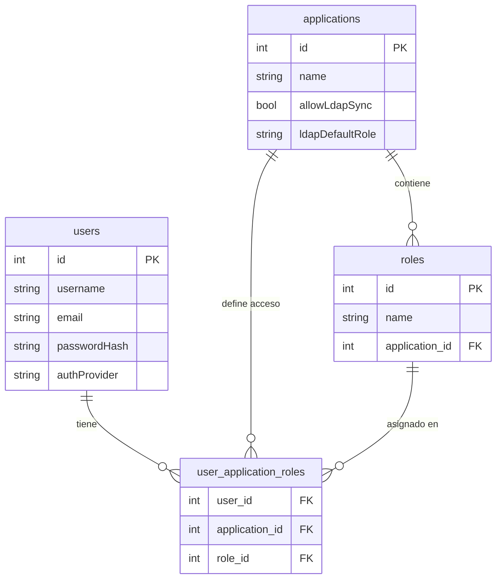

# auth_APP — Servicio de Autenticación y Autorización

Microservicio REST de autenticación multi-proveedor con JWT, RBAC por aplicación y soporte opcional para LDAP/Active Directory.

Forma parte del ecosistema **secHTTPS** — sistema de gestión de certificados SSL/TLS.

---

## Descripción general

`auth_APP` resuelve el problema de gestionar distintos tipos de usuario con acceso controlado a múltiples aplicaciones desde un único punto de autenticación.

### Modos de operación

**Modo base de datos (obligatorio)**  
La base de datos PostgreSQL es siempre requerida, independientemente de cómo se autentiquen los usuarios. Es el componente central del sistema:
- Almacena usuarios, aplicaciones y la asignación de roles (`user_application_roles`)
- Gestiona todo el RBAC: asignación, revocación y auditoría de roles via API `/admin`
- Los usuarios LDAP se sincronizan automáticamente en la BD la primera vez que se autentican, para poder asignarles roles

**Modo LDAP/Active Directory (opcional, apilable)**  
Se pueden configurar **uno o varios** servidores LDAP (o dominios Active Directory) que actúan como providers de autenticación adicionales:
- El sistema prueba cada provider en orden de prioridad hasta que uno tiene éxito
- Si todos los LDAP fallan o no están disponibles, cae en el provider de base de datos como fallback
- Útil para integrar usuarios corporativos de AD sin necesidad de crearles contraseña local

Ejemplos de configuración:
- **Solo BD:** `ENABLE_LDAP=false` — autenticación únicamente con usuarios de la BD local
- **LDAP + BD fallback:** un servidor LDAP como provider primario, BD como fallback
- **Múltiples LDAP + BD fallback:** varios dominios AD (p. ej. filiales) con BD como último recurso

> **Nota:** El JWT incluye en su payload el campo `authProvider` identificando qué proveedor autenticó al usuario (`DATABASE`, `ldap://servidor:389`, etc.).

---

## Stack tecnológico

| Capa | Tecnología |
|---|---|
| Runtime | Node.js 18+ · TypeScript (strict, ES2021) |
| Framework HTTP | Express v5 |
| Autenticación | jsonwebtoken · bcrypt · ldapjs |
| Base de datos | PostgreSQL 15 (driver `pg`) |
| Caché | In-memory (LRU + TTL configurable) |
| Testing | Vitest 4 · Supertest |
| Contenedores | Docker · Docker Compose |

---

## Arquitectura

Implementa **Clean Architecture** / Hexagonal:

```mermaid
graph LR
  subgraph domain["domain/  —  Núcleo (sin dependencias externas)"]
    E["errors/\nDomainError"]
    R["repositories/\nIUserRepository · IApplicationRepository"]
    S["services/\nITokenService · IPasswordHasher · IAuthenticationProvider"]
    U["usecases/\nLogin · Refresh · Validate · Register\nCRUD usuarios · RoleManagement · VerifyAccess"]
    VO["value-objects/\nEmail · Password · Username · UserId · AuthProvider · Token"]
  end

  subgraph infra["infrastructure/  —  Adaptadores"]
    CA["cache/\nMemoryCacheService (LRU + TTL)"]
    DB["database/\nPostgreSQL · migraciones · seeds"]
    MW["middleware/\nauthMiddleware · errorHandler"]
    PE["persistence/\nPostgresUserRepository · InMemoryUserRepository\nPostgresApplicationRepository · InMemoryApplicationRepository"]
    SE["security/\nJWTService · PasswordHasher\nDatabaseAuthProvider · LDAPAuthProvider"]
    TR["transport/\nAuthController · AdminController · UserAdminController\nauthRoutes (/auth) · adminRoutes (/admin)"]
  end

  infra -- implementa --> domain
```



**Regla clave:** el directorio `domain/` no importa nada de `infrastructure/`. Toda dependencia fluye hacia adentro.

---

## Flujo de autenticación

```mermaid
flowchart TD
    C(["Cliente\nPOST /auth/login"])
    C --> L[LoginUseCase]

    subgraph providers["Providers — primer éxito gana"]
        direction TB
        L1["LDAP / AD  servidor 1\n&#40;si ENABLE_LDAP=true&#41;"]
        L2["LDAP / AD  servidor 2"]
        LN["... más servidores LDAP_SERVERS"]
        DBA["Database\n&#40;siempre presente como fallback&#41;"]
        L1 -->|no disponible / fallo| L2
        L2 -->|no disponible / fallo| LN
        LN -->|no disponible / fallo| DBA
    end

    L --> L1

    L1 -->|éxito| PG[("PostgreSQL\nsiempre requerida")]
    L2 -->|éxito| PG
    LN -->|éxito| PG
    DBA -->|éxito| PG

    PG --> EX{"¿Usuario\nexiste?"}
    EX -->|Sí| ROLES["Obtener roles de BD\nsingle-app o multi-app"]
    EX -->|No + allowLdapSync| CRE["Crear usuario en BD\nsync automático LDAP"]
    CRE --> ROLES

    ROLES --> JWT["JWTService.generateTokenPair\n{ userId · username · authProvider · roles }"]
    JWT --> RESP(["Set-Cookie: accessToken + refreshToken\nhttpOnly · Secure"])
```



Los tokens se envían en **cookies httpOnly** para evitar exposición a JavaScript del cliente. También se aceptan como `Authorization: Bearer <token>`.

---

## API — Endpoints

### Autenticación pública (`/auth`)

| Método | Ruta | Descripción |
|---|---|---|
| `POST` | `/auth/login` | Autenticar usuario (devuelve par de tokens en cookies) |
| `POST` | `/auth/refresh` | Renovar access token usando refresh token |
| `POST` | `/auth/validate` | Validar access token y obtener payload |
| `POST` | `/auth/register` | Registrar nuevo usuario |
| `POST` | `/auth/logout` | Limpiar cookies de sesión |

#### POST /auth/login

```json
// Body
{ "username": "admin", "password": "Admin123", "applicationName": "secHTTPS_APP" }

// Response 200
{
  "user": { "id": "1", "username": "admin", "role": "admin", "authProvider": "DATABASE" }
}
// Cookies: accessToken (1 min), refreshToken (5 min)  [configurables via JWT_CONFIG]
```

Si se omite `applicationName`, el token incluye los roles en **todas** las aplicaciones del usuario (token multi-app).

---

### Administración protegida (`/admin`)

> **Requiere:** `Authorization: Bearer <accessToken>` (o cookie) con rol `admin`.

#### Gestión de roles

| Método | Ruta | Descripción |
|---|---|---|
| `POST` | `/admin/roles/assign` | Asignar rol a usuario en aplicación |
| `POST` | `/admin/roles/revoke` | Revocar rol de usuario en aplicación |
| `POST` | `/admin/roles/revoke-all-in-app` | Revocar todos los roles de un usuario en una app |
| `POST` | `/admin/roles/revoke-all` | Revocar todos los roles del usuario en todas las apps |
| `POST` | `/admin/cache/invalidate` | Invalidar caché de roles de un usuario |

#### Gestión de usuarios

| Método | Ruta | Descripción |
|---|---|---|
| `POST` | `/admin/users` | Crear usuario |
| `GET` | `/admin/users` | Listar todos los usuarios |
| `GET` | `/admin/users/:id` | Obtener usuario por ID |
| `PUT` | `/admin/users/:id` | Actualizar usuario |
| `DELETE` | `/admin/users/:id` | Eliminar usuario |

---

## RBAC — Control de acceso basado en roles

El modelo soporta **múltiples roles por usuario por aplicación**:



- Un usuario puede tener rol `admin` en `auth_APP` y rol `viewer` en `secHTTPS_APP` simultáneamente
- La verificación de acceso usa **caché en memoria** con TTL igual a la duración del access token
- Al modificar roles via `/admin`, la caché se invalida automáticamente para ese usuario

---

## Instalación y configuración

### Prerrequisitos

- Node.js 18+
- PostgreSQL 15+ (o usar el modo InMemory para desarrollo)
- Docker y Docker Compose (recomendado)

### Con Docker Compose (recomendado)

```bash
# Desde la raíz del monorepo
docker compose up -d

# La base de datos se crea y migra automáticamente
```

### En local

```bash
cd auth_APP
npm install

# Configurar variables de entorno
cp .env.example .env
# Editar .env con tus valores (ver sección Variables de entorno)

# Crear base de datos y ejecutar migraciones
npm run db:migrate

# Iniciar en modo desarrollo (watch)
npm run dev
```

El servicio arranca en `http://localhost:4000`.

---

## Variables de entorno

Copia `.env.example` a `.env` y ajusta los valores:

```dotenv
# Servidor
PORT=4000
NODE_ENV=development

# Base de datos — credenciales de superusuario (solo para la migración 000)
PG_ADMIN_USER=postgres
PG_ADMIN_PASSWORD=your_postgres_password

# Base de datos — credenciales de la aplicación
PG_HOST=localhost
PG_PORT=5432
PG_USER=auth
PG_PASSWORD=your_app_password
PG_DATABASE=auth_db
USE_POSTGRES=true

# JWT (cambiar en producción — mínimo 32 caracteres)
JWT_ACCESS_SECRET=your-super-secret-access-key-change-in-production-min32chars
JWT_REFRESH_SECRET=your-super-secret-refresh-key-change-in-production-min32chars

# Usuario admin inicial (InMemory / dev)
ADMIN_USERNAME=admin
ADMIN_EMAIL=admin@auth.com
ADMIN_PASSWORD=ChangeMe123!

# LDAP (opcional)
ENABLE_LDAP=false
LDAP_SERVERS=[]

# Logging
LOG_LEVEL=info           # debug | info | warn | error
LOG_AUTH_ATTEMPTS=false  # true para loguear intentos de login
LOG_LDAP_DEBUG=false     # true para depuración LDAP
```

> ⚠️ `ADMIN_PASSWORD` **no tiene valor por defecto** en producción. Si no está definida, el servicio lanza un error al arrancar.

---

## Testing

```bash
# Todos los tests
npm test

# Solo unitarios
npm run test:unit

# Solo integración
npm run test:integration

# Con cobertura
npm run test:coverage
```

### Resultado actual

```
Test Files  18 passed (18)
     Tests  283 passed (283)
  Duration  ~7s
```

### Tipos de test

| Tipo | Ficheros | Qué cubren |
|---|---|---|
| **Unitarios** | `tests/unit/domain/usecases/` | LoginUseCase, RefreshTokenUseCase, CreateUserUseCase, DeleteUserUseCase, GetUsers*, Register, RoleManagement, VerifyUserAccess |
| **Unitarios** | `tests/unit/domain/value-objects/` | Email, Password, Username |
| **Unitarios** | `tests/unit/infrastructure/cache/` | MemoryCacheService (LRU, TTL, cleanup, stop) |
| **Unitarios** | `tests/unit/infrastructure/middleware/` | errorHandler (DomainError mapping, 401/404/500) |
| **Dominio** | `tests/domain/` | AuthProvider value object |
| **Integración** | `tests/integration/` | API completa HTTP (login, refresh, validate, logout, LDAP sync) |

Los tests de integración levantan la app con repositorios InMemory — **no requieren base de datos**.

---

## Scripts de base de datos

```bash
npm run db:migrate            # Crear BD y ejecutar todas las migraciones
npm run db:reset              # Borrar y recrear todo (⚠️ destruye datos)
npm run user:create:viewer    # Crear usuario con rol viewer en secHTTPS_APP
npm run user:create:editor    # Crear usuario con rol editor en secHTTPS_APP
npm run user:create:auditor   # Crear usuario con rol auditor en secHTTPS_APP
```

---

## Decisiones de diseño

### ¿Por qué Clean Architecture?
Permite cambiar la base de datos (PostgreSQL ↔ InMemory) sin tocar los casos de uso ni los tests de dominio. El InMemoryRepository es el que usa la suite de tests de integración, eliminando la dependencia de una BD real en CI.

### ¿Por qué tokens en httpOnly cookies?
Impide que JavaScript del cliente (XSS) acceda a los tokens. Se acepta también `Authorization: Bearer` para compatibilidad con clientes que no soportan cookies (APIs, CLIs).

### ¿Por qué caché en memoria y no Redis?
Simplicidad de despliegue. El TTL de la caché coincide con la duración del access token, por lo que la inconsistencia máxima es igual al tiempo de vida del token. Para producción multi-instancia se reemplazaría la implementación de `ICacheService` por Redis sin tocar los casos de uso.

### ¿Por qué la BD es siempre obligatoria aunque se use LDAP?
LDAP solo resuelve la **autenticación** (¿quién eres?). La **autorización** (¿qué puedes hacer?) se gestiona siempre en la BD mediante RBAC. Aunque todos los usuarios se autentiquen vía AD, sus roles, las aplicaciones a las que tienen acceso y la asignación de permisos viven en PostgreSQL. Además, la BD actúa de fallback de autenticación si el LDAP no está disponible.

### ¿Por qué soporte para múltiples servidores LDAP?
Permite integrar varios dominios Active Directory simultáneamente (filiales, entornos, compañías del grupo). Cada servidor se configura como un objeto JSON en `LDAP_SERVERS` y se prueba en orden de prioridad. Si un servidor no responde (`isAvailable() = false`), el sistema pasa automáticamente al siguiente, sin necesidad de intervención manual.

La arquitectura de providers permite añadir nuevas estrategias (OAuth, SAML) implementando `IAuthenticationProvider` y registrándolas en `authRoutes.ts`.
