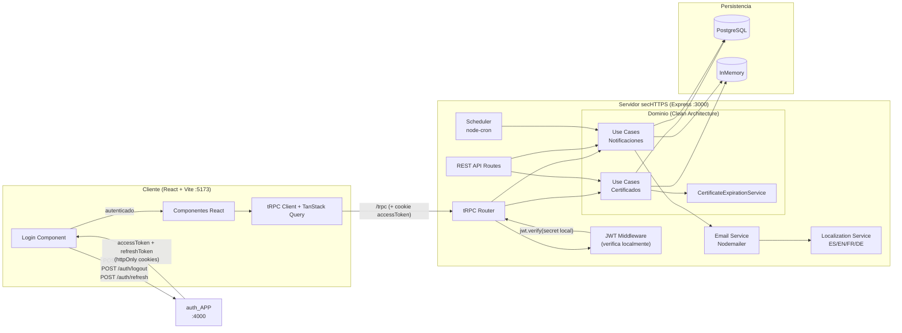
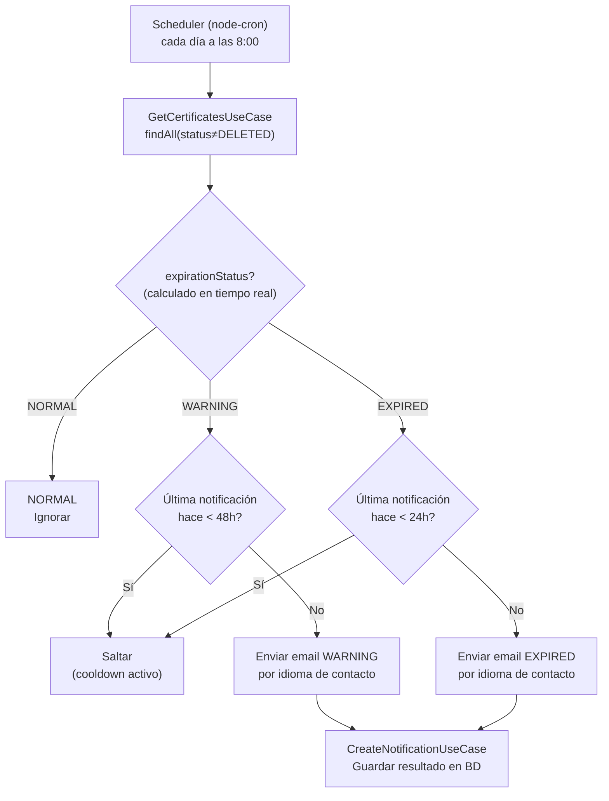
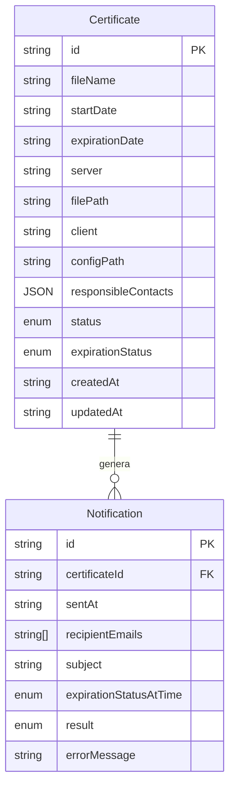

# secHTTPS_APP — Gestión de Certificados SSL/TLS

Sistema fullstack para gestionar el ciclo de vida de certificados SSL/TLS en servidores HTTPS, con monitoreo automático de expiración y notificaciones multiidioma.

---

## Descripción

secHTTPS_APP es una aplicación web completa (**cliente + servidor**) que permite:

- Registrar y gestionar certificados SSL/TLS de múltiples servidores.
- Monitorear su estado de expiración en tiempo real (NORMAL → WARNING → EXPIRED).
- Enviar notificaciones por email personalizadas en el idioma preferido de cada responsable.
- Ejecutar alertas automáticas mediante un scheduler diario configurable.
- Controlar el acceso mediante RBAC delegado en `auth_APP`.

---

## Arquitectura



> **Clave de seguridad:** El servidor `secHTTPS_APP` **nunca llama a `auth_APP`** en tiempo de petición. Verifica el JWT localmente usando el `JWT_ACCESS_SECRET` compartido. Es el **cliente** quien habla con `auth_APP` para login/logout/refresh, recibiendo cookies `httpOnly` que se envían automáticamente en cada petición tRPC.

### Capas (Clean Architecture)

| Capa | Responsabilidad |
|------|-----------------|
| `domain/usecases/` | Lógica de negocio pura (independiente de infraestructura) |
| `domain/services/` | Servicios de dominio (cálculo de expiración, interfaces de email/localización) |
| `domain/repositories/` | Interfaces de persistencia (contratos) |
| `infrastructure/persistence/` | Implementaciones: `InMemory*` y `Postgres*` |
| `infrastructure/trpc/` | Router tRPC + JWT middleware para cliente React |
| `infrastructure/transport/` | Endpoints REST para integración entre servicios |
| `infrastructure/scheduling/` | Scheduler node-cron |
| `infrastructure/messaging/` | Implementación Nodemailer |
| `client/src/` | SPA React con TanStack Query + tRPC |

---

## Flujo de Notificaciones



**Cooldowns:** WARNING → máximo 1 email cada 48h · EXPIRED → máximo 1 email cada 24h

---

## Modelo de Datos



**Estados `expirationStatus`:** `NORMAL` (>7 días) · `WARNING` (0–7 días) · `EXPIRED` (vencido)  
**Estados `status`:** `ACTIVE` · `DELETED` (borrado lógico)  
**Resultados notificación:** `SENT` · `ERROR` · `FORCE`

---

## Stack

| Componente | Tecnología |
|------------|------------|
| Frontend | React 19 + TypeScript + Vite |
| Cliente API | tRPC Client + TanStack Query |
| Servidor | Express 5 + Node.js 20+ |
| API tipada | tRPC |
| Base de datos | PostgreSQL (producción) / InMemory (desarrollo) |
| Email | Nodemailer |
| Scheduler | node-cron |
| Autenticación | JWT via `auth_APP` |
| Tests unitarios | Vitest 4 |
| Tests E2E | Playwright |
| Logging | Logger propio (`LOG_LEVEL`) |

---

## RBAC — Control de Acceso

El acceso está delegado en `auth_APP`. Los tokens JWT contienen el rol del usuario, que se verifica en el middleware tRPC:

| Rol | Certificados | Notificaciones |
|-----|-------------|----------------|
| `admin` | crear, leer, actualizar, eliminar | enviar, leer |
| `editor` | crear, leer, actualizar | — |
| `viewer` | leer | — |

---

## API

### tRPC (cliente React — `/trpc`)

| Procedimiento | Tipo | Descripción |
|---------------|------|-------------|
| `certificate.list` | query | Listar certificados con filtros |
| `certificate.getById` | query | Obtener certificado por ID |
| `certificate.create` | mutation | Crear certificado |
| `certificate.update` | mutation | Actualizar certificado |
| `certificate.updateStatus` | mutation | Cambiar estado (→ DELETED) |
| `certificate.getNotifications` | query | Notificaciones de un certificado |
| `notification.list` | query | Listar notificaciones con filtros |

### REST (integración servicios — `/api`)

| Método | Endpoint | Descripción |
|--------|----------|-------------|
| `GET` | `/api/certif` | Listar certificados |
| `POST` | `/api/certif` | Crear certificado |
| `GET` | `/api/certif/:id` | Obtener por ID |
| `PUT` | `/api/certif/:id` | Actualizar |
| `PATCH` | `/api/certif/:id/status` | Cambiar estado |
| `GET` | `/api/certif/:id/notifications` | Notificaciones del certificado |
| `GET` | `/api/notif` | Listar notificaciones |
| `POST` | `/api/notif` | Registrar notificación |

---

## Instalación

### Prerrequisitos

- Node.js 20+
- PostgreSQL 15+ (opcional — hay modo InMemory)
- `auth_APP` en ejecución (para autenticación JWT)

### Pasos

```bash
# Desde la raíz del monorepo
cd secHTTPS_APP
npm install

# Configurar entorno
cp .env.example .env
# Editar .env con tus valores

# Base de datos (si usas PostgreSQL)
npm run db:migrate

# Arrancar servidor + cliente en modo desarrollo (concurrently)
npm run dev
```

---

## Variables de Entorno

```env
# ─── Cliente (Vite) ────────────────────────────────
VITE_BACKEND_URL=http://localhost:3000   # URL del servidor secHTTPS_APP
VITE_AUTH_APP_URL=http://localhost:4000  # URL de auth_APP (login/logout/refresh)

# ─── Servidor ──────────────────────────────────────
PORT=3000
NODE_ENV=development
LOG_LEVEL=info           # debug | info | warn | error

# ─── Base de Datos ─────────────────────────────────
USE_POSTGRES=false        # false → InMemory (no requiere DB)
DB_HOST=localhost
DB_PORT=5432
DB_NAME=certificates
DB_USER=postgres
DB_PASSWORD=postgres

# ─── CORS / Frontend ───────────────────────────────
CLIENT_URL=http://localhost:5173

# ─── JWT (debe coincidir con auth_APP) ─────────────
JWT_SECRET=tu-secreto-compartido

# ─── SMTP (email) ──────────────────────────────────
SMTP_HOST=smtp.gmail.com
SMTP_PORT=587
SMTP_SECURE=false
SMTP_USER=tu-email@gmail.com
SMTP_PASSWORD=tu-app-password

# ─── Scheduler ─────────────────────────────────────
ENABLE_SCHEDULER=true
CRON_EXPRESSION=0 8 * * *   # cada día a las 8:00 AM
```

---

## Scripts

```bash
npm run dev              # Servidor + cliente con hot-reload (concurrently)
npm run dev:server       # Solo servidor (tsx --watch)
npm run dev:client       # Solo cliente (vite)
npm run build            # Build completo (server + client)
npm run test:run         # Tests unitarios/integración (una pasada)
npm run test:watch       # Tests en modo watch
npm run test:coverage    # Tests con cobertura
npm run test:e2e         # Tests Playwright (requiere servidor activo)
npm run db:migrate       # Ejecutar migraciones SQL
npm run db:reset         # Resetear base de datos
npm run notify:send      # Lanzar proceso de notificaciones manualmente
npm run docker:up        # Levantar PostgreSQL con Docker
npm run docker:down      # Parar contenedores
```

---

## Tests

```
Test Files  12 passed (12)
     Tests  101 passed (101)
```

| Tipo | Archivos | Tests | Descripción |
|------|----------|-------|-------------|
| Unit | 8 | 51 | Use cases de certificados y notificaciones |
| Unit (servicio) | 1 | 9 | `CertificateExpirationService` |
| Unit (use case complejo) | 1 | 8 | `SendCertificateNotificationsUseCase` |
| Integration | 2 | 33 | REST API de certificados y notificaciones |
| E2E | 1 | — | Playwright (separado de Vitest) |

### Estructura de tests

```
tests/
├── unit/
│   ├── domain/
│   │   └── usecases/
│   │       ├── certificates/
│   │       │   ├── CreateCertificateUseCase.test.ts
│   │       │   ├── GetCertificatesUseCase.test.ts
│   │       │   ├── GetCertificateByIdUseCase.test.ts
│   │       │   ├── UpdateCertificateUseCase.test.ts
│   │       │   └── UpdateCertificateStatusUseCase.test.ts
│   │       └── notifications/
│   │           ├── CreateNotificationUseCase.test.ts
│   │           ├── GetNotificationsUseCase.test.ts
│   │           └── GetCertificateNotificationsUseCase.test.ts
│   └── SendCertificateNotificationsUseCase.test.ts
├── integration/
│   ├── certificates.test.ts
│   └── notifications.test.ts
└── e2e/
    └── certificate-management.spec.ts
src/domain/services/
└── CertificateExpirationService.test.ts   # colocado junto a la implementación
```

---

## Decisiones de Diseño

### Persistencia dual
La aplicación soporta dos modos via `USE_POSTGRES=false/true`:
- **InMemory**: ideal para desarrollo/tests, sin dependencias externas.
- **PostgreSQL**: producción, persistencia real.

La inyección de dependencias en `createApp()` garantiza que los use cases desconozcan la implementación real.

### tRPC para el cliente, REST para integración
El frontend usa tRPC para tipado extremo-a-extremo sin generar clientes. Los REST endpoints conviven para integraciones entre servicios o llamadas desde scripts externos.

### Scheduler no bloquea la respuesta HTTP
El scheduling de notificaciones corre completamente fuera del ciclo HTTP. Los errores en el envío de emails se registran como notificaciones `ERROR` pero no interrumpen el flujo de creación de certificados.

### Borrado lógico
Los certificados nunca se eliminan físicamente — solo cambian a `status: DELETED`. Esto preserva el historial de notificaciones asociado y permite auditoría.

### Expiración calculada en tiempo real
`CertificateExpirationService.calculateExpirationStatus()` recalcula el estado usando `new Date()` en cada llamada. Al crear o actualizar un certificado, el estado se almacena en BD para facilitar los filtros de búsqueda.
