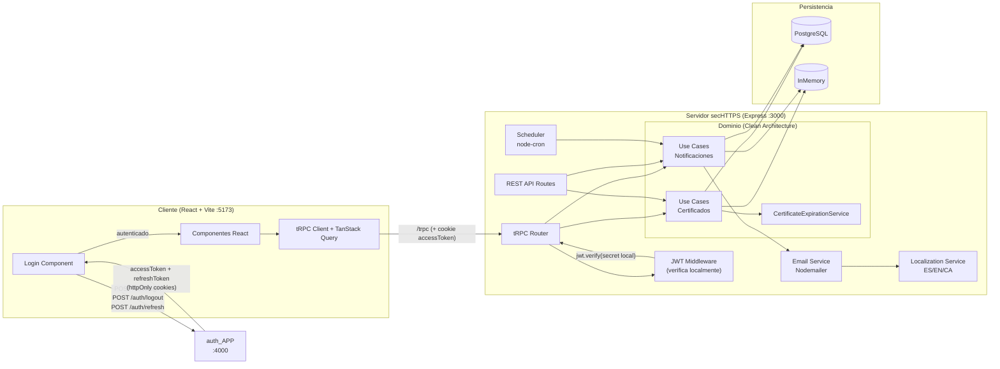

# secHTTPS_APP — Gestión de Certificados SSL/TLS

Sistema fullstack para gestionar el ciclo de vida de certificados SSL/TLS en servidores HTTPS, con monitoreo automático de expiración y notificaciones multiidioma.

---

## Descripción

secHTTPS_APP es una aplicación web completa (**cliente + servidor**) que permite:

- Registrar y gestionar certificados SSL/TLS de múltiples servidores.
- Monitorear su estado de expiración en tiempo real (NORMAL → WARNING → EXPIRED).
- Enviar notificaciones por email personalizadas en el idioma preferido de cada responsable.
- Ejecutar alertas automáticas mediante un scheduler diario configurable.
- Controlar el acceso mediante RBAC delegado en `auth_APP`.

---

## Arquitectura



> **Clave de seguridad:** El servidor `secHTTPS_APP` **nunca llama a `auth_APP`** en tiempo de petición. Verifica el JWT localmente usando el `JWT_ACCESS_SECRET` compartido. Es el **cliente** quien habla con `auth_APP` para login/logout/refresh, recibiendo cookies `httpOnly` que se envían automáticamente en cada petición tRPC.

### Capas (Clean Architecture)

| Capa | Responsabilidad |
|------|-----------------|
| `domain/usecases/` | Lógica de negocio pura (independiente de infraestructura) |
| `domain/services/` | Servicios de dominio (cálculo de expiración, interfaces de email/localización) || `domain/valueObjects/` | Value Objects de dominio (`EmailAddress`, `LanguageCode`, `CertificateDateRange`) || `domain/repositories/` | Interfaces de persistencia (contratos) |
| `infrastructure/persistence/` | Implementaciones: `InMemory*` y `Postgres*` |
| `infrastructure/trpc/` | Router tRPC + JWT middleware para cliente React |
| `infrastructure/transport/` | Endpoints REST para integración entre servicios |
| `infrastructure/scheduling/` | Scheduler node-cron |
| `infrastructure/messaging/` | Implementación Nodemailer |
| `client/src/` | SPA React con TanStack Query + tRPC |

### Value Objects

Los Value Objects encapsulan reglas de negocio como invariantes de construcción. Solo pueden crearse a través de su método `create()`, que lanza `ValidationError` si los datos no son válidos. Una vez construidos, su estado es inmutable.

| Value Object | Invariante | Error code |
|---|---|---|
| `EmailAddress` | Formato RFC válido (`user@domain.ext`), normalizado a minúsculas | `INVALID_EMAIL_FORMAT` |
| `LanguageCode` | Pertenece a `SupportedLanguage` (`es`, `en`, `fr`, `de`) | `INVALID_LANGUAGE_CODE` |
| `CertificateDateRange` | `expirationDate` estrictamente posterior a `startDate` y ambas fechas parseables | `INVALID_DATE_RANGE` |

Se usan internamente en los use cases (`CreateCertificateUseCase`, `UpdateCertificateUseCase`) para validar los datos de entrada. Los DTOs siguen siendo `string` / `string[]` — los Value Objects no se exponen en la capa de transporte.

---

## Flujo de Notificaciones

```mermaid
flowchart TD
    CRON["Scheduler (node-cron)\ncada día a las 8:00"]
    GET["GetCertificatesUseCase\nfindAll(status≠DELETED)"]
    FILTER{"expirationStatus?\n(calculado en tiempo real)"}
    NORMAL["NORMAL\nIgnorar"]
    WARN_CHECK{"Última notificación\nhace < 48h?"}
    EXP_CHECK{"Última notificación\nhace < 24h?"}
    SKIP["Saltar\n(cooldown activo)"]
    SEND_W["Enviar email WARNING\npor idioma de contacto"]
    SEND_E["Enviar email EXPIRED\npor idioma de contacto"]
    SAVE["CreateNotificationUseCase\nGuardar resultado en BD"]

    CRON --> GET
    GET --> FILTER
    FILTER -->|NORMAL| NORMAL
    FILTER -->|WARNING| WARN_CHECK
    FILTER -->|EXPIRED| EXP_CHECK
    WARN_CHECK -->|Sí| SKIP
    WARN_CHECK -->|No| SEND_W
    EXP_CHECK -->|Sí| SKIP
    EXP_CHECK -->|No| SEND_E
    SEND_W --> SAVE
    SEND_E --> SAVE
```



**Cooldowns:** WARNING → máximo 1 email cada 48h · EXPIRED → máximo 1 email cada 24h

---

## Modelo de Datos


**Estados `expirationStatus`:** `NORMAL` (>7 días) · `WARNING` (0–7 días) · `EXPIRED` (vencido)  
**Estados `status`:** `ACTIVE` · `DELETED` (borrado lógico)  
**Resultados notificación:** `SENT` · `ERROR` · `FORCE`

---

## Stack

| Componente | Tecnología |
|------------|------------|
| Frontend | React 19 + TypeScript + Vite |
| Cliente API | tRPC Client + TanStack Query |
| Servidor | Express 5 + Node.js 20+ |
| API tipada | tRPC |
| Base de datos | PostgreSQL (producción) / InMemory (desarrollo) |
| Email | Nodemailer |
| Scheduler | node-cron |
| Autenticación | JWT via `auth_APP` |
| Tests unitarios | Vitest 4 |
| Tests E2E | Playwright |
| Logging | Logger propio (`LOG_LEVEL`) |

---

## RBAC — Control de Acceso

El acceso está delegado en `auth_APP`. Los tokens JWT contienen el rol del usuario, que se verifica en el middleware tRPC:

| Rol | Certificados | Notificaciones |
|-----|-------------|----------------|
| `admin` | crear, leer, actualizar, eliminar | enviar, leer |
| `editor` | crear, leer, actualizar | — |
| `viewer` | leer | — |

### Seguridad del Login (cliente)

El componente `Login` implementa dos mecanismos de protección en el lado cliente:

#### 1. Bloqueo por exceso de intentos fallidos

| Parámetro | Valor |
|---|---|
| Intentos antes del bloqueo | 10 |
| Duración del bloqueo | 3 minutos |

- Cada respuesta `!ok` de `auth_APP` incrementa el contador de intentos.
- Al alcanzar el límite se calcula `lockoutUntil = Date.now() + 3 min` y se persiste en `localStorage` para sobrevivir recargas de página.
- Mientras el bloqueo está activo, el formulario se deshabilita y el botón muestra una cuenta atrás en tiempo real (`🔒 Bloqueado (2:47)`).
- Al expirar el bloqueo se borran los datos de `localStorage` y el formulario vuelve a estar disponible.
- Los mensajes de error son genéricos (*"Acceso incorrecto"*) — no revelan si el usuario existe ni si la contraseña es incorrecta (principio OWASP).

#### 2. Reintentos ante fallo de conexión

- Si el `fetch` a `auth_APP` lanza un error de red (`TypeError` / `Failed to fetch`), se muestra el modal `ServerErrorModal`.
- El modal ofrece hasta **3 reintentos** automáticos con feedback visual (spinner + "Intento N de 3").
- Si los 3 intentos fallan, el modal pasa a modo de error final con instrucción de contactar al responsable.
- Una vez que la conexión se recupera, el modal se cierra automáticamente y el flujo de login continúa con normalidad.

```
retryCount=0 → ⚠️  Servidor Inaccesible  → botón [🔄 Reintentar]
retryCount=1 → ⏳  Conectando...         → spinner (intento 2 de 3)
retryCount=1 → ⚠️  Servidor Inaccesible  → botón [🔄 Reintentar]  (si falla)
retryCount=3 → 🚫  Conexión Fallida      → botón [🚪 Salir]  (rojo)
```

---

## API

### tRPC (cliente React — `/trpc`)

| Procedimiento | Tipo | Descripción |
|---------------|------|-------------|
| `certificate.list` | query | Listar certificados con filtros |
| `certificate.getById` | query | Obtener certificado por ID |
| `certificate.create` | mutation | Crear certificado |
| `certificate.update` | mutation | Actualizar certificado |
| `certificate.updateStatus` | mutation | Cambiar estado (→ DELETED) |
| `certificate.getNotifications` | query | Notificaciones de un certificado |
| `notification.list` | query | Listar notificaciones con filtros |

### REST (integración servicios — `/api`)

La API REST se mantiene de forma **intencionada** junto a tRPC por las siguientes razones:

- **Interoperabilidad:** permite que herramientas externas (scripts `curl`, Postman, pipelines CI/CD, otros microservicios) consuman la API sin depender de la librería tRPC ni del cliente React.
- **Separación de capas de transporte:** el cliente React usa tRPC con type-safety end-to-end; los consumidores externos usan REST con autenticación Bearer estándar. Cada capa sirve a su audiencia.
- **Agnóstica al cliente:** cualquier sistema capaz de hacer peticiones HTTP puede integrarse sin acoplamiento a la implementación interna.

Ambas capas comparten los mismos use cases del dominio y están protegidas con `authMiddleware` (JWT Bearer).

| Método | Endpoint | Descripción |
|--------|----------|-------------|
| `GET` | `/api/certif` | Listar certificados |
| `POST` | `/api/certif` | Crear certificado |
| `GET` | `/api/certif/:id` | Obtener por ID |
| `PUT` | `/api/certif/:id` | Actualizar |
| `PATCH` | `/api/certif/:id/status` | Cambiar estado |
| `GET` | `/api/certif/:id/notifications` | Notificaciones del certificado |
| `GET` | `/api/notif` | Listar notificaciones |
| `POST` | `/api/notif` | Registrar notificación |

---

## Instalación

### Prerrequisitos

- Node.js 20+
- PostgreSQL 15+ (opcional — hay modo InMemory)
- `auth_APP` en ejecución (para autenticación JWT)

### Pasos

```bash
# Desde la raíz del monorepo
cd secHTTPS_APP
npm install

# Configurar entorno
cp .env.example .env
# Editar .env con tus valores

# Base de datos (si usas PostgreSQL)
npm run db:migrate

# Arrancar servidor + cliente en modo desarrollo (concurrently)
npm run dev
```

---

## Variables de Entorno

```env
# ─── Cliente (Vite) ────────────────────────────────
VITE_BACKEND_URL=http://localhost:3000   # URL del servidor secHTTPS_APP
VITE_AUTH_APP_URL=http://localhost:4000  # URL de auth_APP (login/logout/refresh)

# ─── Servidor ──────────────────────────────────────
PORT=3000
NODE_ENV=development
LOG_LEVEL=info           # debug | info | warn | error

# ─── Base de Datos ─────────────────────────────────
USE_POSTGRES=false        # false → InMemory (no requiere DB)
DB_HOST=localhost
DB_PORT=5432
DB_NAME=certificates
DB_USER=postgres
DB_PASSWORD=postgres

# ─── CORS / Frontend ───────────────────────────────
CLIENT_URL=http://localhost:5173

# ─── JWT (debe coincidir con auth_APP) ─────────────
JWT_SECRET=tu-secreto-compartido

# ─── SMTP (email) ──────────────────────────────────
SMTP_HOST=smtp.gmail.com
SMTP_PORT=587
SMTP_SECURE=false
SMTP_USER=tu-email@gmail.com
SMTP_PASSWORD=tu-app-password

# ─── Scheduler ─────────────────────────────────────
ENABLE_SCHEDULER=true
CRON_EXPRESSION=0 8 * * *   # cada día a las 8:00 AM
```

---

## Scripts

```bash
npm run dev              # Servidor + cliente con hot-reload (concurrently)
npm run dev:server       # Solo servidor (tsx --watch)
npm run dev:client       # Solo cliente (vite)
npm run build            # Build completo (server + client)
npm run test:run         # Tests unitarios/integración (una pasada)
npm run test:watch       # Tests en modo watch
npm run test:coverage    # Tests con cobertura
npm run test:e2e         # Tests Playwright (requiere servidor activo)
npm run db:migrate       # Ejecutar migraciones SQL
npm run db:reset         # Resetear base de datos
npm run notify:send      # Lanzar proceso de notificaciones manualmente
npm run docker:up        # Levantar PostgreSQL con Docker
npm run docker:down      # Parar contenedores
```

---

## Tests

```
Test Files  15 passed (15)
     Tests  137 passed (137)
```

| Tipo | Archivos | Tests | Descripción |
|------|----------|-------|-------------|
| Unit (value objects) | 3 | 36 | `EmailAddress`, `LanguageCode`, `CertificateDateRange` |
| Unit (use cases) | 8 | 51 | Use cases de certificados y notificaciones |
| Unit (servicio) | 1 | 9 | `CertificateExpirationService` |
| Unit (use case complejo) | 1 | 8 | `SendCertificateNotificationsUseCase` |
| Integration | 2 | 33 | REST API de certificados y notificaciones |
| E2E | 1 | — | Playwright (separado de Vitest) |

### Estructura de tests

```
tests/
├── unit/
│   ├── domain/
│   │   ├── valueObjects/
│   │   │   ├── EmailAddress.test.ts
│   │   │   ├── LanguageCode.test.ts
│   │   │   └── CertificateDateRange.test.ts
│   │   └── usecases/
│   │       ├── certificates/
│   │       │   ├── CreateCertificateUseCase.test.ts
│   │       │   ├── GetCertificatesUseCase.test.ts
│   │       │   ├── GetCertificateByIdUseCase.test.ts
│   │       │   ├── UpdateCertificateUseCase.test.ts
│   │       │   └── UpdateCertificateStatusUseCase.test.ts
│   │       └── notifications/
│   │           ├── CreateNotificationUseCase.test.ts
│   │           ├── GetNotificationsUseCase.test.ts
│   │           └── GetCertificateNotificationsUseCase.test.ts
│   └── SendCertificateNotificationsUseCase.test.ts
├── integration/
│   ├── certificates.test.ts
│   └── notifications.test.ts
└── e2e/
    └── certificate-management.spec.ts
src/domain/services/
└── CertificateExpirationService.test.ts   # colocado junto a la implementación
```

---

## Decisiones de Diseño

### Persistencia dual
La aplicación soporta dos modos via `USE_POSTGRES=false/true`:
- **InMemory**: ideal para desarrollo/tests, sin dependencias externas.
- **PostgreSQL**: producción, persistencia real.

La inyección de dependencias en `createApp()` garantiza que los use cases desconozcan la implementación real.

### tRPC para el cliente, REST para integración
El frontend usa tRPC para tipado extremo-a-extremo sin generar clientes. Los REST endpoints conviven para integraciones entre servicios o llamadas desde scripts externos.

### Scheduler no bloquea la respuesta HTTP
El scheduling de notificaciones corre completamente fuera del ciclo HTTP. Los errores en el envío de emails se registran como notificaciones `ERROR` pero no interrumpen el flujo de creación de certificados.

### Borrado lógico
Los certificados nunca se eliminan físicamente — solo cambian a `status: DELETED`. Esto preserva el historial de notificaciones asociado y permite auditoría.

### Expiración calculada en tiempo real
`CertificateExpirationService.calculateExpirationStatus()` recalcula el estado usando `new Date()` en cada llamada. Al crear o actualizar un certificado, el estado se almacena en BD para facilitar los filtros de búsqueda.

### Value Objects para invariantes de dominio
Las reglas de validación que pertenecen al dominio (`EmailAddress`, `LanguageCode`, `CertificateDateRange`) se encapsulan en Value Objects en lugar de en métodos privados de los use cases. Esto garantiza que la lógica de validación sea reutilizable, testeable de forma aislada e imposible de eludir: si un Value Object se construye con éxito, la invariante está cumplida. Los DTOs de la capa de transporte siguen usando tipos primitivos (`string`) para simplicidad de serialización.

### Bloqueo de login y reintentos en cliente
La lógica de protección contra fuerza bruta y fallos de conexión vive íntegramente en el cliente (`Login.tsx`), independiente del servidor. Esto evita que el servidor tenga que gestionar estado de sesión de intentos y cumple con las recomendaciones OWASP de no revelar información interna. El bloqueo se persiste en `localStorage` para sobrevivir recargas, y el contador de reintentos de red es independiente del contador de intentos de autenticación: un fallo de red no penaliza el contador de bloqueo.
