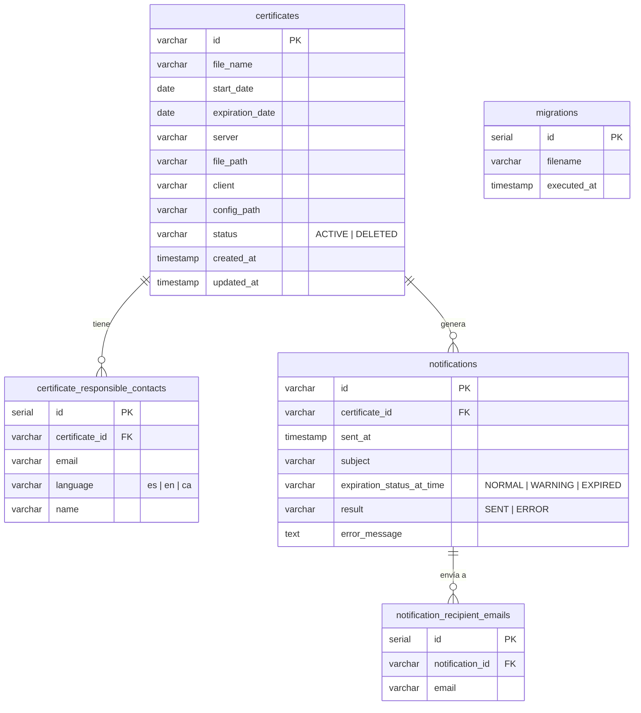

# secHTTPS_APP — Gestión de Certificados SSL/TLS

Aplicación web completa (backend + frontend) para registrar, monitorizar y recibir alertas sobre
certificados SSL/TLS instalados en servidores. Forma parte del monorepo `secHTTPS` junto a
`auth_APP`, que gestiona toda la autenticación y autorización.

> Documentación técnica detallada en [`docs/`](docs/) · Decisiones de arquitectura en [`adr/`](adr/)

---

## Índice

1. [Visión funcional](#1-visión-funcional)
2. [Control de acceso por rol (RBAC)](#2-control-de-acceso-por-rol-rbac)
3. [Arquitectura del sistema](#3-arquitectura-del-sistema)
4. [Estructura del proyecto](#4-estructura-del-proyecto)
5. [Diagramas de secuencia](#5-diagramas-de-secuencia)
6. [Sistema de migraciones](#6-sistema-de-migraciones)
7. [Modelo de datos](#7-modelo-de-datos)
8. [API](#8-api)
9. [Instalación](#9-instalación)
10. [Variables de entorno](#10-variables-de-entorno)
11. [Scripts disponibles](#11-scripts-disponibles)
12. [Tests](#12-tests)
13. [Documentación técnica](#13-documentación-técnica)

---

## 1. Visión funcional

### ¿Qué hace esta aplicación?

```
Usuario →  Login (auth_APP) → Accede a secHTTPS_APP
                                    ↓
                     Gestiona certificados SSL/TLS:
                       · Alta / Edición / Baja lógica
                       · Cada certificado tiene responsables
                         con idioma preferido (ES · EN · CA)
                                    ↓
                     Monitorización automática (servidor):
                       · Estado calculado en tiempo real
                         NORMAL → WARNING (≤7 días) → EXPIRED
                       · Scheduler diario: detecta WARNING/EXPIRED
                         y envía email a cada responsable
                         en su idioma (ES / EN / CA)
                       · Cooldowns: WARNING cada 48h / EXPIRED cada 24h
                                    ↓
                     Historial de notificaciones de cada certificado
```

### Flujo funcional por pantalla

| Pantalla | Qué permite hacer |
|---|---|
| **Login** | Autenticarse contra LDAP corporativo o base de datos local. Bloqueo tras 10 intentos fallidos (3 min). Modal de reintento ante fallos de red. |
| **Lista de certificados** | Ver todos los certificados con estado de expiración calculado. Filtrar por cliente, servidor, nombre, estado y estado de expiración. |
| **Detalle / Edición** | Ver datos completos, editar, cambiar estado a DELETED. Acciones protegidas por rol. |
| **Crear certificado** | Formulario con validación de dominio (Value Objects). El servidor envía email de confirmación al crear. |
| **Notificaciones** | Historial de alertas enviadas por el scheduler. Solo lectura. |

### Seguridad y resiliencia en el login

El componente `Login.tsx` implementa dos mecanismos independientes de protección:

**1. Bloqueo por intentos fallidos de credenciales (rate limiting frontend)**

| Parámetro | Valor |
|---|---|
| Intentos permitidos | 10 |
| Duración del bloqueo | 3 minutos |
| Persistencia | `localStorage` — sobrevive recargas de página |
| Contador | Se resetea en login exitoso |

- Cada credencial incorrecta incrementa `loginAttempts`.
- Al alcanzar 10, se activa un bloqueo con cuenta atrás en tiempo real (actualiza cada segundo).
- El estado se persiste en `localStorage[loginLockout]` → si el usuario recarga la página durante el bloqueo, el tiempo restante se recupera y el formulario sigue bloqueado.
- Los reintentos lanzados desde el **modal de error de servidor** (ver más abajo) **no incrementan** este contador — solo los intentos manuales del usuario cuentan.

**2. Modal de error de servidor (resiliencia ante infraestructura no disponible)**

Se distinguen dos causas de error de infraestructura, ambas muestran un modal con botón "Reintentar":

| Causa | Código interno | Qué muestra |
|---|---|---|
| `auth_APP` o backend no responden (red caída, servidor apagado) | `CONNECTION_ERROR` / `Failed to fetch` | Modal genérico de conexión |
| LDAP corporativo no disponible (auth_APP responde, pero LDAP falla) | `LDAP_UNAVAILABLE` | Modal con el mensaje de error específico de LDAP |

- El modal lleva un contador de reintentos (`retryCount`).
- Al pulsar "Reintentar", se vuelve a lanzar el login con las mismas credenciales.
- Si el servidor vuelve a responder y las credenciales son incorrectas, el modal se cierra y se muestra el error de credenciales (contando como un único intento fallido).
- Si el servidor responde y el login tiene éxito, todo se resetea.

**3. Sesión expirada**

Cuando el `accessToken` expira y el refresh también (o falla), el interceptor redirige al login con `?sessionExpired=true`. El componente detecta el parámetro, muestra un mensaje y pre-rellena el campo username con el último usuario de `localStorage`.

---

## 2. Control de acceso por rol (RBAC)

El token JWT (emitido por `auth_APP`) contiene el rol del usuario. El servidor lo extrae de la
cookie `httpOnly` en cada petición y aplica los permisos correspondientes.

> El rol se asigna en `auth_APP` por un administrador. El usuario no puede modificar su propio rol.

| Acción | `admin` | `editor` | `viewer` | `auditor` |
|---|:---:|:---:|:---:|:---:|
| Ver listado de certificados | ✅ | ✅ | ✅ | ✅ |
| Ver detalle de certificado | ✅ | ✅ | ✅ | ✅ |
| Crear certificado | ✅ | ✅ | — | — |
| Editar certificado | ✅ | ✅ | — | — |
| Dar de baja certificado (DELETED) | ✅ | ✅ | — | — |
| Ver notificaciones | ✅ | — | — | ✅ |
| Lanzar envío manual de notificaciones | ✅ | — | — | — |

Lanzar envío manual de notificaciones* -> por desarrollar

Las acciones no permitidas para el rol del usuario quedan visualmente deshabilitadas en el
frontend (botones ocultos o inactivos) y adicionalmente rechazadas en el servidor.

---

## 3. Arquitectura del sistema

### 3.1. Vista general


> **Punto clave de seguridad:** el servidor `secHTTPS_APP` **nunca llama a `auth_APP`** durante
> una petición. Verifica el JWT localmente con el `JWT_ACCESS_SECRET` compartido. Es el
> *cliente* (navegador) quien habla con `auth_APP` para login / logout / refresh.

### 3.2. Clean Architecture — Hexagonal

El proyecto aplica los principios de Clean Architecture (también llamada Hexagonal o
Ports & Adapters). Las reglas son:

1. **Regla de dependencias**: las capas internas no conocen las externas — el dominio no
   importa nada de Express, PostgreSQL ni Nodemailer.
2. **Puertos** (interfaces) en el dominio expresan lo que el dominio *necesita*
   (`ICertificateRepository`, `IEmailService`, `ILocalizationService`).
3. **Adaptadores** en la infraestructura implementan esos puertos
   (`PostgresCertificateRepository`, `NodemailerEmailService`).
4. **Composición en el borde**: `createApp()` selecciona las implementaciones concretas
   sin que los use cases lo sepan.
5. **DTOs** en la capa de transporte; **Value Objects / Entidades** solo en el dominio.

```
┌──────────────────────────────────────────────────────────────┐
│  TRANSPORT LAYER  (Express · tRPC · REST)                    │
│  — Serialización/deserialización, cookies, cabeceras HTTP    │
└──────────────────────┬───────────────────────────────────────┘
                       │ DTOs (primitivos)
┌──────────────────────▼───────────────────────────────────────┐
│  APPLICATION LAYER  (Use Cases)                              │
│  — Orquestación: obtener datos, aplicar reglas, persistir    │
└──────────────────────┬───────────────────────────────────────┘
                       │ Entidades / Value Objects
┌──────────────────────▼───────────────────────────────────────┐
│  DOMAIN LAYER  (Entities · VOs · Interfaces · Services)      │
│  — Reglas de negocio puras, sin IO, sin frameworks           │
└──────────────────────────────────────────────────────────────┘
        ↑ implementan los puertos (interfaces de dominio)
┌───────────────────────────────────────────────────────────────┐
│  INFRASTRUCTURE LAYER                                         │
│  PostgreSQL · InMemory · Nodemailer · node-cron · tRPC/REST  │
└───────────────────────────────────────────────────────────────┘
```

### 3.3. Value Objects de dominio

Los Value Objects encapsulan invariantes de construcción. Solo se crean a través de `create()`,
que lanza `ValidationError` si los datos no son válidos. Una vez construidos son inmutables.

| Value Object | Invariante |
|---|---|
| `EmailAddress` | Formato RFC válido, normalizado a minúsculas |
| `LanguageCode` | Pertenece a `SupportedLanguage` (`es`, `en`, `ca`) |
| `CertificateDateRange` | `expirationDate` estrictamente posterior a `startDate` |

### 3.4. tRPC + REST: coexistencia intencionada

| Canal | Consumidor | Por qué |
|---|---|---|
| `/trpc` | Frontend React | Type-safety end-to-end sin generar clientes |
| `/api/certif`, `/api/notif` | Scripts externos, Postman, pipelines CI/CD | Interoperabilidad estándar HTTP |

Ambos canales comparten los mismos use cases del dominio y el mismo middleware JWT.

---

## 4. Estructura del proyecto

### 4.1. Backend (`src/`)

```
src/
├── app.ts                        # Factory: createApp() — composición de dependencias
├── server.ts                     # Punto de entrada: startServer()
│
├── domain/
│   ├── repositories/             # Puertos (interfaces) de persistencia
│   │   ├── ICertificateRepository.ts
│   │   └── INotificationRepository.ts
│   ├── services/
│   │   ├── CertificateExpirationService.ts   # NORMAL / WARNING / EXPIRED
│   │   ├── IEmailService.ts                  # Puerto de email
│   │   └── ILocalizationService.ts           # Puerto de localización
│   ├── usecases/
│   │   ├── certificates/
│   │   │   ├── CreateCertificateUseCase.ts   # + email de confirmación
│   │   │   ├── GetCertificatesUseCase.ts
│   │   │   ├── GetCertificateByIdUseCase.ts
│   │   │   ├── UpdateCertificateUseCase.ts
│   │   │   └── UpdateCertificateStatusUseCase.ts
│   │   └── notifications/
│   │       ├── CreateNotificationUseCase.ts
│   │       ├── GetNotificationsUseCase.ts
│   │       ├── GetCertificateNotificationsUseCase.ts
│   │       └── SendCertificateNotificationsUseCase.ts  # Proceso cron
│   └── value-objects/
│       ├── EmailAddress.ts
│       ├── LanguageCode.ts
│       └── CertificateDateRange.ts
│
├── infrastructure/
│   ├── database/
│   │   ├── connection.ts                     # Pool PostgreSQL (singleton)
│   │   ├── migrator.ts                       # Motor de migraciones
│   │   └── migrations/
│   │       ├── 000_create_database.sql       # Creación BD (admin pool)
│   │       ├── 001_create_certificates_table.sql
│   │       └── 002_create_notifications_table.sql
│   ├── localization/
│   │   ├── LocalizationService.ts
│   │   └── templates/
│   │       ├── es/  ca/  en/                 # JSON por idioma y tipo de email
│   ├── messaging/
│   │   └── NodemailerEmailService.ts
│   ├── middleware/
│   │   ├── authMiddleware.ts                 # Verifica JWT de cookie
│   │   └── requestLogger.ts
│   ├── persistence/
│   │   ├── CertificateRepository.ts          # InMemory
│   │   ├── NotificationRepository.ts         # InMemory
│   │   ├── PostgresCertificateRepository.ts
│   │   └── PostgresNotificationRepository.ts
│   ├── scheduling/
│   │   └── NotificationScheduler.ts          # node-cron wrapper
│   ├── transport/
│   │   ├── controllers/
│   │   │   ├── CertificateController.ts
│   │   │   └── NotificationController.ts
│   │   └── routes/
│   │       ├── certificateRoutes.ts
│   │       └── notificationRoutes.ts
│   └── trpc/
│       ├── trpc.ts                           # Instancia tRPC + contexto JWT
│       └── routers/
│           ├── index.ts                      # App Router (combina sub-routers)
│           ├── certificateRouter.ts
│           └── notificationRouter.ts
│
├── scripts/
│   ├── migrate.ts                            # npm run db:migrate
│   ├── reset-db.ts                           # npm run db:reset
│   └── send-notifications.ts                 # npm run notify:send
└── types/
    ├── certificate.ts
    ├── notification.ts
    ├── errors.ts
    └── shared.ts
```

### 4.2. Frontend (`client/src/`)

```
client/src/
├── main.tsx                      # Entry point — TRPCProvider + QueryClientProvider
├── App.tsx                       # Routing: Login ↔ Aplicación autenticada
│
├── components/
│   ├── auth/
│   │   └── Login.tsx             # Form login + bloqueo + modal reintento
│   ├── certificates/
│   │   ├── CertificatesList.tsx  # Listado principal con filtros
│   │   ├── CertificatesTable.tsx # Tabla paginada
│   │   ├── CertificateCard.tsx   # Tarjeta individual (estado expiración coloreado)
│   │   ├── CertificateFilters.tsx
│   │   ├── CertificateForm.tsx   # Formulario crear/editar
│   │   ├── CertificateModal.tsx  # Modal detalle/edición
│   │   └── CreateCertificateModal.tsx
│   ├── layout/
│   │   └── AppHeader.tsx         # Cabecera: usuario, rol, logout
│   └── ui/
│       ├── LoadingOverlay.tsx
│       └── ServerErrorModal.tsx  # Modal LDAP no disponible / error de conexión
│
├── hooks/
│   ├── useAuth.ts                # Estado de sesión: user, roles, logout
│   ├── usePermissions.ts         # Derivado del rol: canCreate, canEdit, canDelete…
│   └── useServerConnection.ts   # Gestión reintentos de conexión
│
└── utils/
    ├── trpc.ts                   # Cliente tRPC configurado (URL backend)
    └── logger.ts
```

**Hook `usePermissions`:** centralize toda la lógica de qué puede hacer cada rol. Los
componentes llaman a `const { canCreate, canEdit } = usePermissions()` sin necesidad de
conocer los nombres de roles ni comparar strings.

---

## 5. Diagramas de secuencia

### 5.1. Login y acceso a la aplicación


### 5.2. Renovación automática de token (Refresh)


### 5.3. Crear certificado


### 5.4. Proceso automático de notificaciones (scheduler)


### 5.5. Bloqueo de cuenta por intentos fallidos


### 5.6. Servidor de autenticación no disponible


---

## 6. Sistema de migraciones

> **Cuándo se ejecutan:** las migraciones **no corren automáticamente** al arrancar el servidor.
> Deben lanzarse explícitamente con `npm run db:migrate` — antes de la primera puesta en marcha
> y cada vez que se añadan nuevos ficheros de migración al proyecto.

Las migraciones son ficheros SQL numerados con prefijo de 3 dígitos, ubicados en
`src/infrastructure/database/migrations/`. El motor `DatabaseMigrator` gestiona la ejecución
de forma idempotente:

```
000_create_database.sql   → Ejecuta contra la BD postgres (con usuario admin)
                             Crea el usuario, la BD y concede privilegios.
                             Se re-ejecuta siempre, idempotente por diseño.

001_create_certificates_table.sql  ┐
002_create_notifications_table.sql ┘ Migraciones regulares — BD de la aplicación
NNN_descripcion.sql                   Se ejecutan en orden numérico
```

**Control de versiones de esquema:**


**Reglas para añadir migraciones:**

- Nombrar con el siguiente número correlativo: `003_descripcion.sql`
- Las migraciones **ya ejecutadas nunca se modifican** — crear una nueva `NNN+1_fix_...sql`
- Las migraciones regulares se ejecutan dentro de una transacción (`BEGIN / COMMIT / ROLLBACK`)
- La migración `000_` se ejecuta con un pool de administrador (credenciales `PG_ADMIN_USER` /
  `PG_ADMIN_PASSWORD`) — necesario para crear la base de datos y el usuario

---

## 7. Modelo de datos



**Estados `expirationStatus`** (calculado en tiempo real por `CertificateExpirationService`):

| Estado | Condición |
|---|---|
| `NORMAL` | Más de 7 días para caducar |
| `WARNING` | 7 días o menos para caducar |
| `EXPIRED` | Fecha de caducidad superada |

---

## 8. API

### tRPC — `/trpc` (cliente React)

| Procedimiento | Tipo | Rol mínimo | Descripción |
|---|---|---|---|
| `certificate.list` | query | viewer | Listar con filtros opcionales |
| `certificate.getById` | query | viewer | Detalle por ID |
| `certificate.create` | mutation | editor | Crear + email de confirmación |
| `certificate.update` | mutation | editor | Actualizar datos |
| `certificate.updateStatus` | mutation | editor | Cambiar a DELETED |
| `certificate.getNotifications` | query | viewer | Notificaciones del certificado |
| `notification.list` | query | viewer | Listar notificaciones |

### REST — `/api` (integración externa)

| Método | Endpoint | Descripción |
|---|---|---|
| `GET` | `/api/certif` | Listar certificados (filtros por query string) |
| `POST` | `/api/certif` | Crear certificado |
| `GET` | `/api/certif/:id` | Obtener por ID |
| `PUT` | `/api/certif/:id` | Actualizar |
| `PATCH` | `/api/certif/:id/status` | Cambiar estado |
| `GET` | `/api/certif/:id/notifications` | Notificaciones del certificado |
| `GET` | `/api/notif` | Listar notificaciones |
| `POST` | `/api/notif` | Registrar notificación |

Especificación completa: [`docs/openapi.yaml`](docs/openapi.yaml)

---

## 9. Instalación

### Prerrequisitos

- Node.js 20+
- PostgreSQL 16+ (opcional — hay modo InMemory para desarrollo y tests)
- `auth_APP` en ejecución y accesible (proporciona los tokens JWT)

### 9.1. Desarrollo local

```bash
# Desde la raíz del monorepo
cd secHTTPS_APP

# Instalar dependencias (backend + frontend)
npm install
cd client && npm install && cd ..

# Copiar y editar variables de entorno
cp .env.example .env
# Editar .env con los valores de tu entorno local

# Iniciar PostgreSQL (si usas Docker)
npm run docker:up

# Ejecutar migraciones (solo si USE_POSTGRES=true)
npm run db:migrate

# Arrancar backend + frontend con hot-reload (concurrently)
npm run dev
```

El backend estará en `http://localhost:3000` y el frontend en `http://localhost:5173`.

> Para conectar con la BD PostgreSQL que corre en el servidor de producción desde local,
> usar un túnel SSH (mantener la terminal abierta):
> ```bash
> ssh -N -L 5432:localhost:5432 usuario@servidor.produccion
> ```

### 9.2. Producción (servidor)

Las aplicaciones se gestionan con **PM2**. El servidor ya tiene el repositorio clonado
en `/opt/secHTTPS`.

**Primera instalación:**

```bash
# En el servidor
cd /opt/secHTTPS/secHTTPS_APP
npm install
cd client && npm install && npm run build && cd ..
npm run build

# Ejecutar migraciones (solo la primera vez o al añadir nuevas)
npm run db:migrate

# Iniciar con PM2
pm2 start dist/server.js --name secHTTPS_server
pm2 save
```

**Actualización:**

```bash
cd /opt/secHTTPS
git pull

# Si falla el pull por cambios locales en package-lock.json:
# git checkout -- secHTTPS_APP/package-lock.json

cd secHTTPS_APP
npm install
npm run build
npm run db:migrate     # Solo aplica migraciones nuevas (idempotente)
pm2 restart secHTTPS_server

# Verificar
pm2 list
pm2 logs secHTTPS_server --lines 30
```

**Variables de entorno en producción:**

```bash
# Diferencias clave respecto a desarrollo:
CLIENT_URL=https://servidor.empresa.local:puerto
VITE_AUTH_APP_URL=https://servidor.empresa.local:puerto
VITE_BACKEND_URL=https://servidor.empresa.local:puerto
NODE_ENV=production
USE_POSTGRES=true
```

---

## 10. Variables de entorno

Fichero de referencia: `.env.example`

```env
# ─── Servidor ──────────────────────────────────────────────────────────────
PORT=3000
NODE_ENV=development
LOG_LEVEL=info           # debug | info | warn | error

# ─── Base de datos ─────────────────────────────────────────────────────────
USE_POSTGRES=false        # false → InMemory (sin PostgreSQL)
PG_HOST=localhost
PG_PORT=5432
PG_DATABASE=sechttps_db
PG_USER=sechttps_user
PG_PASSWORD=contraseña_segura
# Solo para npm run db:migrate (creación de BD):
PG_ADMIN_USER=postgres
PG_ADMIN_PASSWORD=contraseña_admin

# ─── CORS / Frontend ───────────────────────────────────────────────────────
CLIENT_URL=http://localhost:5173

# ─── JWT — debe coincidir exactamente con auth_APP ─────────────────────────
JWT_ACCESS_SECRET=mismo-secreto-que-en-auth_APP
APPLICATION_NAME=secHTTPS_APP

# ─── SMTP ──────────────────────────────────────────────────────────────────
SMTP_HOST=smtp.gmail.com
SMTP_PORT=587
SMTP_SECURE=false
SMTP_USER=notificaciones@empresa.com
SMTP_PASSWORD=app-password

# ─── Scheduler ─────────────────────────────────────────────────────────────
ENABLE_SCHEDULER=true
CRON_EXPRESSION=0 8 * * *   # cada día a las 08:00 (formato cron estándar)

# ─── Frontend (Vite — prefijo VITE_ expuesto al cliente) ───────────────────
VITE_BACKEND_URL=http://localhost:3000
VITE_AUTH_APP_URL=http://localhost:4000
```

---

## 11. Scripts disponibles

```bash
npm run dev              # Backend + frontend con hot-reload (concurrently)
npm run dev:server       # Solo backend (tsx --watch)
npm run dev:client       # Solo frontend (vite)
npm run build            # Build completo (tsc + vite)
npm run test:run         # Tests unitarios e integración (una pasada, sin watch)
npm run test:watch       # Tests en modo watch
npm run test:coverage    # Tests con informe de cobertura
npm run test:e2e         # Tests Playwright E2E (requiere servidor activo)
npm run db:migrate       # Ejecutar migraciones SQL pendientes
npm run db:reset         # Resetear base de datos (¡destructivo!)
npm run notify:send      # Lanzar el proceso de notificaciones manualmente
npm run docker:up        # Levantar PostgreSQL con Docker Compose
npm run docker:down      # Parar contenedores Docker
```

---

## 12. Tests

```
Test Files  15 passed
     Tests  137 passed
```

| Tipo | Tests | Qué cubre |
|---|---|---|
| Unit — Value Objects | 36 | `EmailAddress`, `LanguageCode`, `CertificateDateRange` |
| Unit — Use Cases | 51 | Los 9 use cases de certificados y notificaciones |
| Unit — Servicio | 9 | `CertificateExpirationService` (cálculo de estados) |
| Unit — Use Case complejo | 8 | `SendCertificateNotificationsUseCase` (cooldowns, flujo cron) |
| Integration | 33 | API REST completa de certificados y notificaciones |
| E2E (Playwright) | 6 | Login, listado, filtros, logout — flujo completo en navegador (separado de Vitest) |

**Los tests de integración usan siempre InMemory** (sin PostgreSQL), garantizando ejecución
rápida (~1 s) y sin dependencias externas. Ver [`docs/002_Testing.md`](docs/002_Testing.md).

---

## 13. Documentación técnica

| Documento | Contenido |
|---|---|
| [`docs/001_ApiDesign.md`](docs/001_ApiDesign.md) | Diseño de la API REST: modelos, endpoints, reglas de negocio |
| [`docs/002_Testing.md`](docs/002_Testing.md) | Estrategia de testing, configuración Vitest, buenas prácticas |
| [`docs/003_DatabaseImplementation.md`](docs/003_DatabaseImplementation.md) | Esquema de BD, migraciones, repositorios PostgreSQL |
| [`docs/003_Localization.md`](docs/003_Localization.md) | Sistema multiidioma: templates JSON, flujo por contacto |
| [`docs/004_CodeQuality.md`](docs/004_CodeQuality.md) | Correcciones SonarQube, best practices TypeScript aplicadas |
| [`docs/004_EnvironmentConfiguration.md`](docs/004_EnvironmentConfiguration.md) | Guía completa de variables de entorno |
| [`docs/005_NotificationSystem.md`](docs/005_NotificationSystem.md) | Arquitectura del scheduler, configuración SMTP, troubleshooting |
| [`docs/006_AuthIntegration.md`](docs/006_AuthIntegration.md) | Integración con auth_APP: middleware JWT, cookies httpOnly |
| [`docs/006b_AuthSecurity_AccessRefresh.md`](docs/006b_AuthSecurity_AccessRefresh.md) | Seguridad Access + Refresh Token: comparativa, flujo completo |
| [`docs/openapi.yaml`](docs/openapi.yaml) | Especificación OpenAPI 3.0 (endpoints REST + esquemas) |
| [`docs/TESTING_E2E.md`](docs/TESTING_E2E.md) | Guía de tests Playwright E2E |
| [`adr/`](adr/) | Registro de Decisiones de Arquitectura (ADR) |
